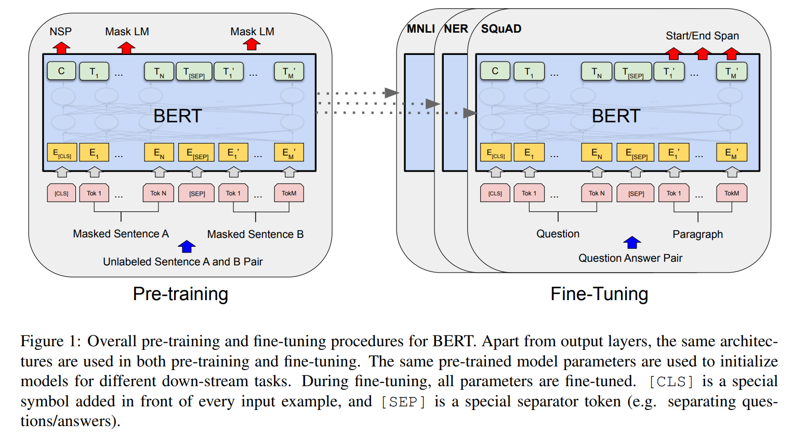

#  论文： BERT： Pre-training of Deep Bidirectional Transformers for Language Understanding

## 参考

[BERT论文逐段精读[论文精读]](https://www.bilibili.com/video/BV1PL411M7eQ/?spm_id_from=333.337.search-card.all.click&vd_source=550e50f36bb6f32ba43eb2af3f8307be)

**BERT**: **B**idirectional **E**ncoder **R**epresentations from **T**ransformers.

## Abstract

介绍了一种新的语言表示模型：BERT，基于Transformer的双向编码表示（**B**idirectional **E**ncoder **R**epresentations from **T**ransformers，也表达了BERT名字的由来）

与最近的语言模型（**ELMo**，**GPT**）不同，BERT旨在通过在所有层中联合左右上下文从未标记的文本中预训练深层双向表示。因此，只需要一个输出层，就可以对预训练的BERT模型进行微调（`fine-tune`），完成各种任务。

BERT很牛，在11项NLP任务上取得了最新的最先进的结果。

* GLUE得分提高到了80.5% (7.7%的绝对提高)，
* MultiNLI准确率提高到了86.7% （4.6%的绝对改善），
* SQuAD v1.1回答测试F1提高到93.2（1.5的绝对改进），
* 将DQuADv2.0测试F1提高至83.1（5.1分的绝对提升）

## 1 Introduction

预训练已经证明对于NLP任务是有效的 (词嵌入、GPT)

NLP任务包含两类：句子层面的任务 (句子情绪、句子间关系)，token-level任务 (命名实体的识别),where models are required to produce fine-grained output at the token level

在使用预训练模型做特征表示，一般有两类策略：[`feature-base` ](# feature-base & fine-tuning)(ELMo) , [`fine-tuning`](# feature-base & fine-tuning) (GPT). 这两种都有一个特点：都是单向的。  

BERT使用了一种双向掩码语言模型（完形填空）

## 2 Related Work

### 2.1 Unsupervised Feature-based Approaches

BERT证明了在NLP任务上，使用大量没有标号的训练集训练比在有标号的相对小一点的数据集上训练的效果好

 

## 3 BERT

BERT中有两个步骤：`pre-training` 和 `fine-tuning`.

在预训练中，输入是一些没有标号的句子对

在训练的时候，创建一个相同的BERT，但权重的初始化值使用预训练的权重数据。每个任务有自己的有标号的数据，进行训练得到目标任务的BERT模型。

$BERT_{BASE} (L=12, H=768, A=12, Total Parameters=110M)$ 

$BERT_{LARGE} (L=24, H=1024, A=16, Total Parameters=340M)$​ 

$ L:多少层Transformer\qquad H:h	\qquad A:多头数量 $

base和GPT的规模差不多，large是为了刷榜

### Input & Output

有些任务是处理一个句子，有些任务是为了处理两个句子，所以BERT的输入可以是一个句子，也可以是一个句子对。“sentence” 的意思是一段连续的文字，不一定是语义上的句子。输入的 ”sequence“ 可以是一个句子，也可以是两个句子。

使用 `WordPiece` 切词，如果某个词出现概率不大， 则只保留子序列。用一个30000 token的词典就能表示一个比较大的文本了。

例： 

* playing -> play , ##ing
* flightless -> flight , ##less

任务1：

`[CLS]`: (classification) 每个句子的标识，按理说放在哪里都可以

`[SEP]` (Seperation) : 划分两个句子的中间线

`[MASK]` : 掩码。选择15%的词进行掩码操作。其中80%的词直接变为[MASK]，10%替换成其他词，10%什么也不做就标记一下这个词用来做预测

任务2：预测下一个句子（NSP）

学习一些句子层面的东西。两个输入句子A和B，50%的概率两个句子是连续的（IsNext，正例），50%的概率两个句子是随机拼凑的（NotNext，负例）。

 

数据集：

* BooksCorpus （88M words）
* English Wikipedia (2,500M words)

## Conclusion

最近一些试验表明：使用非监督的预训练是非常好的，这样使得资源不多的任务也能够享受深度神经网络。

# 其他笔记

## feature-base & fine-tuning

**相同点**：

都是借助别人已有NLP模型完成自己的任务

**feature-base**:

将训练好的特征作为输入，让训练结果更好。比如通过某算法得出非常符合目标任务的词嵌入矩阵，然后让这个词嵌入矩阵作为模型的某个参数

**fine-tuning**:

使用大量库训练一个基础模型，然后在这个基础模型的基础上增加上下游的输入输出器，每次训练基础模型的参数也会跟着随之微调改变
