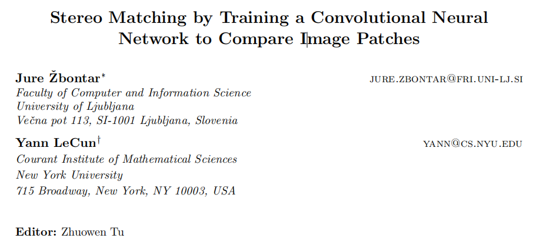
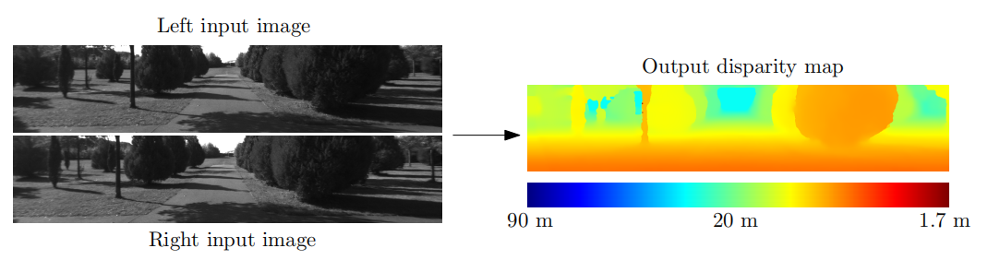

# [论文翻译]： Stereo Matching by Training a Convolutional Neural Network to Compare Image Patches

通过训练卷积神经网络比较图像块进行立体匹配

* **作者**: Jure Žbontar, Yann LeCun
* **出版社**: Journal of Machine Learning Research (CCF A)
* **首次提交**: 2015年10月20日
* **最近修改**: 2016年05月18日
* **论文链接**: https://arxiv.org/abs/1510.05970

## Abstract

​	我们提出了一种从校正图像对中提取深度信息的方法。我们的方法专注于许多立体算法的第一阶段：匹配代价计算。我们通过使用卷积神经网络学习小图像块的相似性度量来解决这个问题。训练过程采用监督学习方法，构建了一个包含相似和不相似图像块对示例的二分类数据集。我们研究了两种针对此任务的网络架构：一种优化了速度，另一种优化了准确性。卷积神经网络的输出用于初始化立体匹配的代价。随后进行一系列的后处理步骤：基于交叉的代价聚合、半全局匹配、左右一致性检查、亚像素增强、中值滤波和双边滤波。我们在KITTI 2012、KITTI 2015和Middlebury立体数据集上评估了我们的方法，并展示它在所有三个数据集上优于其他方法。

**关键词:** 立体，匹配代价，相似性学习，监督学习，卷积神经网络

## 1 Introduction

考虑以下问题：给定由相机在不同水平位置拍摄的两张图像，我们希望计算左图像中每个像素的视差 ddd。视差是指物体在左图像和右图像中的水平位置差异——左图像中位于 (x,y)(x, y)(x,y) 位置的物体在右图像中出现在 (x−d,y)(x−d, y)(x−d,y) 位置。如果我们知道物体的视差 ddd，可以使用以下关系计算其深度 zzz：
$$
z=\frac{fB}{d}
$$
其中，

- z 是物体的深度，
- f 是摄像机的焦距，
- B 是两个摄像机之间的基线距离，
- d 是物体的视差。

图1：输入是一对来自左摄像机和右摄像机的图像。这两幅输入图像的主要差异在于物体的水平位置（其他差异是由反射、遮挡和透视变形引起的）。注意，距离摄像机较近的物体比远处的物体具有更大的视差。输出是右侧显示的密集视差图，其中较暖的颜色表示较大的视差值（和较小的深度值）。

​	描述的立体匹配问题在许多领域中都很重要，例如自动驾驶、机器人、中间视图生成和3D场景重建。根据Scharstein和Szeliski（2002）的分类，典型的立体算法包括四个步骤：匹配代价计算、代价聚合、优化和视差精炼。根据Hirschmüller和Scharstein（2009）的分类，我们将前两个步骤称为计算匹配代价，后两个步骤称为立体方法。本文的重点是计算良好的匹配代价。我们提出训练一个卷积神经网络（LeCun等，1998），该网络在真实视差已知的小图像块对上进行训练（例如，通过激光雷达或结构光获得）。网络的输出用于初始化匹配代价。

​	我们继续进行一些后处理步骤，这些步骤虽然不新颖，但对于获得良好结果是必要的。匹配代价通过基于交叉的代价聚合在具有相似图像强度的相邻像素之间结合。通过半全局匹配强制执行平滑约束，并使用左右一致性检查来检测和消除遮挡区域中的错误。我们进行亚像素增强，并应用中值滤波和双边滤波以获得最终的视差图。

本文的贡献如下：

- 描述了两种基于卷积神经网络计算立体匹配代价的架构；
- 提供了一种方法及其源代码，该方法在 KITTI 2012、KITTI 2015 和 Middlebury 立体数据集上的错误率最低；以及
- 进行了一系列实验，分析了数据集规模的重要性、与其他方法相比的错误率，以及在不同超参数设置下准确性与运行时间之间的权衡。

​	本文在我们之前的工作（Žbontar 和 LeCun，2015）基础上进行了扩展，新增了一种新架构的描述、两个新数据集的结果、更低的错误率和更全面的实验。

​	在引入像KITTI和Middlebury这样的大型立体数据集之前，相对较少的立体算法使用地面真实信息来学习其模型的参数；在本节中，我们回顾了这样做的一些算法。有关立体算法的概述，请参阅Scharstein和Szeliski（2002）。

​	Kong和Tao（2004）使用平方距离的和来计算初始匹配代价。然后，他们训练了一个模型来预测三类情况的概率分布：初始视差是正确的、初始视差由于前景物体膨胀而不正确，以及初始视差由于其他原因而不正确。预测的概率被用来调整初始匹配代价。Kong和Tao（2006）后来通过结合通过计算不同窗口大小和中心的归一化互相关获得的预测来扩展他们的工作。

​	Peris等人（2012）使用AD-Census（Mei等人，2011）初始化匹配代价，并使用多类线性判别分析来学习从计算的匹配代价到最终视差的映射。

​	地面真实数据也被用来学习概率图模型的参数。 Zhang和Seitz（2007）使用了一种替代优化算法来估计马尔可夫随机场超参数的最优值。 Scharstein和Pal（2007）构建了一个包含30对立体图像的新数据集，并用它来学习条件随机场的参数。 Li和Huttenlocher（2008）提出了一个具有非参数化成本函数的条件随机场模型，并使用结构化支持向量机来学习模型参数。

​	近期的研究（Haeusler等，2013年；Spyropoulos等，2014年）集中于估计计算匹配代价的置信度。Haeusler等（2013年）使用随机森林分类器结合了几种置信度测量。类似地，Spyropoulos等（2014年）训练了一个随机森林分类器来预测匹配代价的置信度，并将这些预测作为软约束应用于马尔可夫随机场，以降低立体方法的误差。

​	与计算匹配代价相关的另一个问题是学习局部图像描述符（Brown等，2011年；Trzcinski等，2012年；Simonyan等，2014年；Revaud等，2015年；Paulin等，2015年；Han等，2015年；Zagoruyko和Komodakis，2015年）。这两个问题共享一个常见的子任务：衡量图像块之间的相似性。Brown等（2011年）引入了一个通用的框架来学习图像描述符，并使用Powell方法选择良好的超参数。解决学习局部图像描述符问题的方法有几种，如boosting（Trzcinski等，2012年）、凸优化（Simonyan等，2014年）、层次移动象限相似性（Revaud等，2015年）、卷积核网络（Paulin等，2015年）和卷积神经网络（Zagoruyko和Komodakis，2015年；Han等，2015年）。特别是Zagoruyko和Komodakis（2015年）以及Han等（2015年）的工作与我们的工作非常相似，主要区别在于网络的架构；具体而言，包括池化和子采样以适应更大的图像块大小和更大的视角变化。