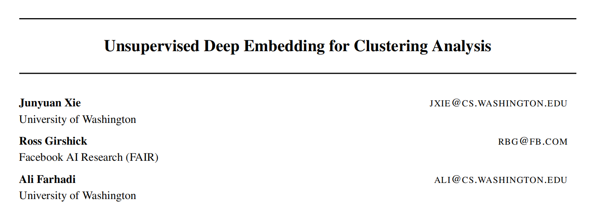
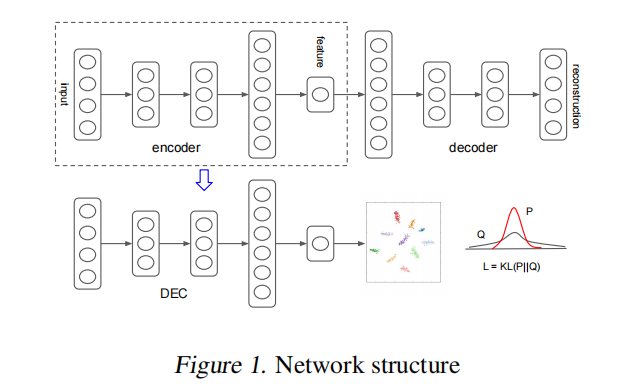
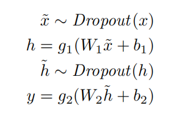
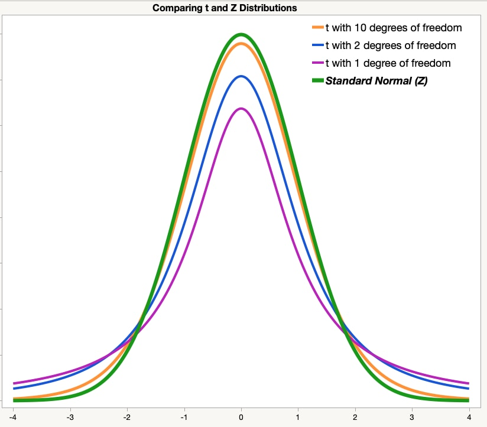

# Unsupervised Deep Embedding for Clustering Analysis

* Author: Junyuan Xie, Rose Girshick, Ali Farhadi
* Pubulication: ICML 2016 (International Conference of Machine Learning, 国际机器学习会议)
* Date: 2016.06
* Link: https://arxiv.org/abs/1511.06335

论文中提出了一种结合深度学习和无监督聚类分析的算法: **DEC**。通过深度学习实现深度嵌入将高维数据映射到低维，然后在嵌入空间上运行K-Means来初始化聚类中心，最后使用KL散度作为目标函数，使用SGD更新参数，同时调整嵌入和聚类结果。

DEC有两个阶段:

- - 用深度自编码器（deep autoencoder）参数初始化；
  - 参数优化，通过迭代计算辅助目标分布和最小化Kullback-Leibler(KL)散度；　

## DEC (Deep embedded clustering)

共 `n` 个点，聚类到 `k` 个簇中，每一个簇的簇心 $\mu_j \ j=(1,k)$

使用非线性映射 $f_\theta:X \to Z$ 进行变换。$\theta$ 是可学习参数，Z 是潜在特征空间。Z 一般比 X 维度小很多。

DEC有两个阶段：

* 使用深度自编码器进行参数初始化
* 参数优化即聚类

### 软分配

使用t分布作为和函数来测量嵌入点$z_i$ 和质心 $\mu_j$ 之间的相似度：
$$
q_{ij} = \frac{(\frac{1+||z_i-\mu_j||^2}{\alpha})^{-\frac{\alpha+1}{2}}}{\sum_{j`}(\frac{1+||z_i-\mu_{j`}||^2}{\alpha})^{-\frac{\alpha+1}{2}}}
$$

* $z_i$ : 非线性映射后的数据点
* $\mu_j$ : 质心
* $q_{ij}$ : 将样本 i 分配给簇 j 的概率。

* $\alpha$ : 由于在无监督设置中我们无法在验证集上交叉验证 α学习 α是多余的，因此我们在所有实验中将 α设为 1。

### 目标分布

$$
p_{ij} = \frac{\frac{q_{ij}^2}{f_j}}{\frac{\sum_{j`}q_{ij`}^2}{f_{j`}}}
$$

$f_j = \sum_iq_{ij}$ 是软簇频率。

### KL散度（目标函数）

将目标定义为软分配  $q_i$ 与辅助分布 $p_i$ 之间的KL散度损失：
$$
L = KL(P||Q) = \sum_i\sum_jlog\frac{p_{ij}}{q_{ij}}
$$

### 优化

使用SGD联合优化$\mu_j$ 和 $\theta$ .
$$
\frac{\partial L}{\partial z_i} = \frac{\alpha + 1}{\alpha} \sum_j(1 + \frac{||z_i-\mu_j||^2}{\alpha})^{-1} \times (p_{ij}-q{ij})(z_i-\mu_j)
\\
\frac{\partial L}{\partial \mu_j} = -\frac{\alpha +1}{\alpha}\sum_i(1+\frac{||z_i-\mu_j||^2}{\alpha})^{-1}
\times (p_{ij}-q{ij})(z_i-\mu_j)
$$
根据梯度值更新DNN的参数。

### 去噪自编码

就是一个两层的神经网络

激活函数使用：ReLUs（修正线性单元）

## 其他总结

### 聚类 clustering

最常见的无监督学习算法，按照某个标准，把一个数据集分割成不同的簇，使得同一个簇内的数据对象的相似性尽可能大，同时不在一个簇的数据差异性也尽可能的大。

聚类和分类的区别：

* 聚类是一种无监督学习，分类是有监督学习
* 聚类是按照规则分割得到结果，分类是根据结果学习分类规则

#### 聚类算法

主流的聚类算法分为两类：

* 划分聚类（Partitioning Clustering） 扁平结构的簇

  * 常用算法有：K-Means/K-Medoids、Gaussian Mixture Model(高斯混合模型)、Spectral Clustering(谱聚类)、Centroid-based Clustering等

* 层次聚类 （Hierarchical Clustering）簇之间具有层次结构

  * 常见算法有：Single-linkage、Complete-linkage、Connectivity-based Clustering等 

  

##### K-Means

[B站讲解视频](https://www.bilibili.com/video/BV1py4y1r7DN/?spm_id_from=333.337.search-card.all.click&vd_source=550e50f36bb6f32ba43eb2af3f8307be)

步骤：

* E: 初始化随机簇点坐标，计算每个节点属于哪个簇点
* M: 更新簇点坐标为所有数据点的重心作为新的簇点坐标。

优缺点：

* 缺点1：簇点中心是簇内节点的质心，所以簇点可能不属于节点
* 缺点2：计算距离时使用的是L2距离的平方，对离群点很敏感，噪声(Noisy Data)和离群点(Outlier)会把中心点拉偏，甚至改变分割线的位置。

##### K-Medoids

为了解决K-Means存在的问题而提出的算法。

* 距离使用L1（距离的绝对值），而不是L2（距离的平方值）距离。
* 簇点不是质心，而是重心附近的节点
* 复杂度更高：O(n) -> O(n^2)

##### 谱聚类

简单来说就是降维，通过将拉普拉斯矩阵转化为特征矩阵将高纬度的数据转化为低纬度的数据后再进行K-Means算法聚类。

具体公式：

相似矩阵`W`：表示每个节点之间的相似性，一般和距离相关。这里使用高斯核函数计算相似度。
$$
W_{ij} = e^{-\frac{||x_i - x_j||^2}{2\sigma^2}}
$$
度矩阵`D`: $D_{ii}$记录每个节点的度,其他为0
$$
D_{ii} = \sum_jW_{ij}
$$
拉普拉斯矩阵`L`:
$$
L = D - W
$$

#### EM (Expextation-maximization algorithm, 期望最大化算法)

循环以下步骤

* 计算期望（E）,利用现有估计量，计算最大似然估计
* 最大化（M），最大化在E步上求得的最大似然值来计算参数的值。，M步上找到的参数估计又被用于下一次E

例子1：抛硬币

现有AB两枚硬币，随机抛5次，计算AB两枚硬币抛出正面的概率。每次不知道抛的是A还是B。

E ： 假设A的概率为0.3，B的概率为0.6，计算每次抛硬币最大概率是A还是B。比如第一次抛，7正3反，则B的概率更大。

M ： 统计5次中最大概率为A的次数中 总正次数/总次数 = 新的P(A)，并用于下一次E步骤。

例2：二维K-Means

E: 随机生成k个簇点的xy值，计算每个节点属于哪个簇点概率最大

M: 统计属于簇点k的所有节点，更新新的簇点xy值

### 距离函数 (Distance Function)

在计算节点与簇点之间距离时设定的距离函数。

1. 欧几里得距离（Euclidean Distance）

最常用的距离度量之一 ，定义为两个节点的直线距离

2. 曼哈顿距离 （Manhattan Distance）
3. 切比雪夫距离 （Chebyshev Distance）
4. 马氏距离 （Mahalanobis Distance）
5. 余弦相似度 （Cosine Similarity）

### 谱理论

在有限维度和空间中，谱理论就是特征值和特征向量的理论。

基础知识：

1. 实对称矩阵具有如下性质：
   * 可以对角化（$A = P \Lambda P^T$）
   * 对称性在加减法中得以保留（$L = D-A \quad L:Laplacian \  matrix$ ）
2. 实对称矩阵的特征值特征向量的性质：
   * 0是有效特征值，但0向量不是有效特征向量
   * 不同的特征值的特征向量相互正交 

### 维度诅咒

“维度诅咒”是指在高维空间中，数据分析和处理变得极其困难的一系列现象和问题。主要问题：

* 数据稀疏性： 数据变得及其稀疏，数据点之间的相似性减少
* 距离度量失效： 在高维空间中，几乎所有的数据点之间的距离区域相同。
* 计算复杂度： 计算复杂度迅速增加，影响计算时间、存储大小，性能显著下降。
* 模型过拟合： 无法很好泛化到新的数据。

### KL散度（Kullback-Leibler Divergence）

KL散度（Kullback-Leibler Divergence），也称为相对熵，是衡量两个概率分布之间差异的指标。

* 梯度 grad
* 散度 div (是常量)是通量的体密度
* 旋度

### 软分配&硬分配

硬分配： 每个数据点是否属于一个簇是明确的。比如K-Means算法。

软分配： 每个数据点与簇之间是概率或者权重关系，比如高斯混合模型中，每个数据点被分配到各个高斯分布的概率总和为1。

硬分配简单一点，但忽略了数据点可能对多个簇的相似性，无法表达数据点在不同簇之间的模糊关系。软分配就是计算复杂度有点高。

### t分布

### SAE （stached autoencoder，堆叠自编码）
