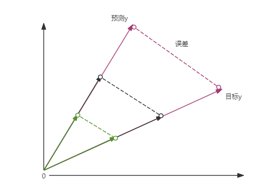
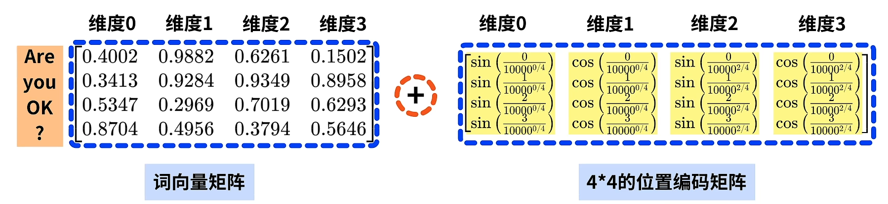
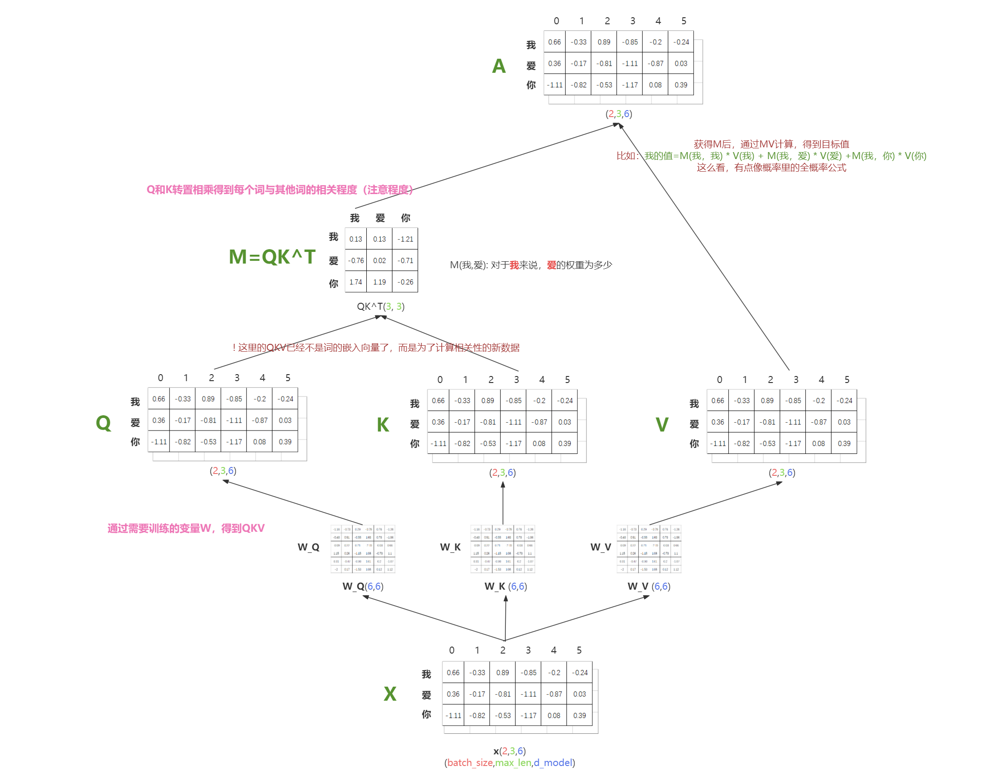
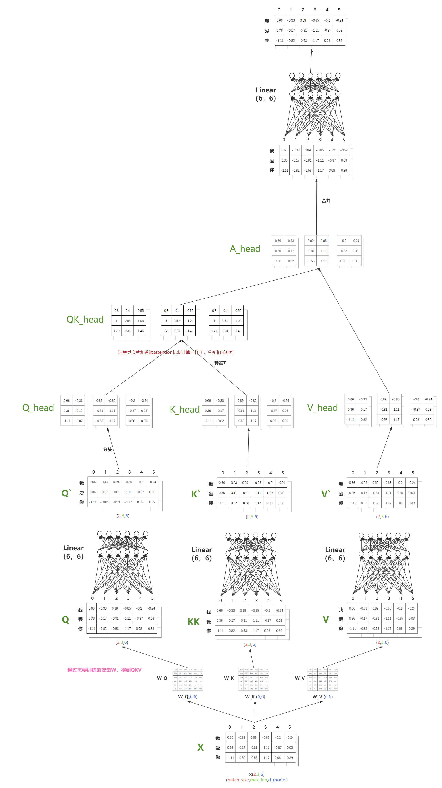
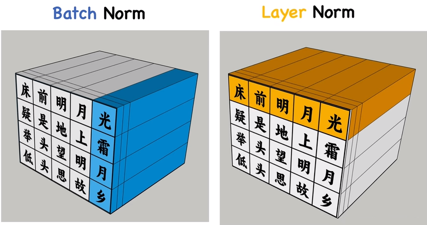
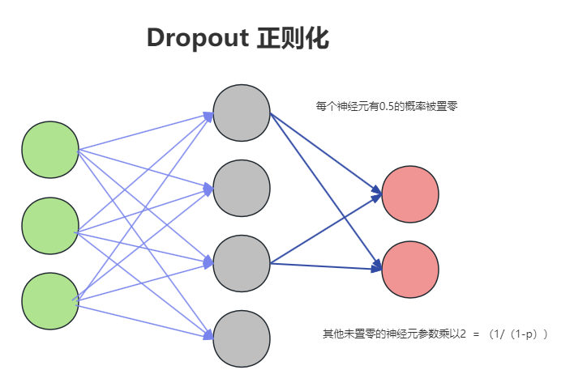

# Transformer 模型分析


## 整体结构

### Input 输入

Transformer模型的输入数据形状通常是三维张量

```
(batch_size, sequence_length, embedding_dim)
```

`batch_size` 是批次大小，表示同时处理的样本数量。

`sequence_length` 是序列长度，表示每个文本序列中词的数量或字符的数量。

`embedding_dim` 是嵌入维度，表示词嵌入的维度或字符嵌入的维度。


### Embedding 词嵌入层

将词用向量表示。

**代码**

* `vocab_size`: 词典大小，只用于词嵌入层使用。也就是决定最后词嵌入矩阵一共有多少个词
* `d_model`: 每个词的维度，一般为512

```python
class Embeddings(nn.Module):
    def __init__(self, vocab_size, d_model):
        super(Embeddings, self).__init__()
        # lookup table: 查找表，类似新华字典的作用，保存每个词的向量信息
        self.lut = nn.Embedding(vocab_size, d_model)
        self.d_model = d_model

    def forward(self, x):
        return self.lut(x) * math.sqrt(self.d_model)
```

进行词嵌入后需要乘以$$ \sqrt{d_{model}} $$，如果在词嵌入时不进行缩放，可能会导致模型训练不稳定或性能下降的情况。在模型训练中，每个向量的尺度十分关键，也就是向量的大小或长度。在词嵌入的上下文中，向量的尺度通常指的是向量的`范数（norm）`，即向量的`欧几里得长度`。

对于一个 n 维向量 x，其范数的定义如下：
$$
∥x∥ = \sqrt{x_1^2 + x_2^2 + \ldots + x_n^2}
$$
因为反向传播过程中，误差值很大程度决定了偏导大小(更新程度)，所以向量的尺度也决定了梯度变化的大小。如图所示，当词向量的尺度很大时，计算的误差就会很大，相应参数更新的倍数就越大。



例：使用均方误差作为损失函数
$$
L = \frac{1}{n}(\hat{y}-y)^2
\\
\frac{\partial L}{\partial w} = 2(\hat{y}-y)\frac{\partial y}{\partial w}
$$


```py
vocab_size = 10  # 词汇表大小（词典也就是查找表中一共有10个词）
embedding_dim = 5  # 嵌入维度(一般为512)

model = Embeddings(vocab_size, embedding_dim)

input_cab = torch.tensor([1,2,3])
output = model(input_cab)
print(output)
```

```
tensor([[ 0.0528, -1.0185,  1.6773,  0.1311,  0.4906],
        [ 0.3935,  0.3868, -0.0640, -0.9105,  1.0717],
        [-1.0727,  1.1457,  1.3508,  1.0211,  0.1830]],
       grad_fn=<EmbeddingBackward0>)
```


### Positional Encoding 位置编码



给词向量矩阵增加位置信息。包括每个词的位置信息`Pos`，和词向量每个维度的`i`。

*为什么需要位置编码*：

每个词原本的词向量信息是确定的，但是同一个词，可能出现的位置是不同的，加上位置编码后，可以表示不同位置的同一个词所代表的向量信息。（其实可以看做一个新的词了，比如一个是‘我-0’，一个是‘我-3’）。

同样维度的索引也加上位置信息的目的也是如此，不同位置的词所需要的维度`i`权重也不一样。比如假设维度0代表主语，维度1代表宾语，而‘我-0’的维度0权重就会更高，‘我-3’的维度1权重就会更高。  

**公式**

pos：词在序列中的位置
i：维度的索引[0,d-1]
d：词的维度大小
$$
PE_{(pos,2i)} = sin(\frac{pos}{10000^{\frac{2i}{d}}})
\\
PE_{(pos,2i+1)} = cos( \frac{pos}{10000^{\frac{2i}{d}}})
\\
$$
**代码**

```python
import torch
import torch.nn as nn
import math

class PositionalEncoding(nn.Module):
    # d_model: 词向量长度
    # max_len: 词个数，因为总是一批一批的，所以这里使用所有批次里的最大长度
    def __init__(self, d_model, max_len):
        super(PositionalEncoding, self).__init__()
        # 全0的矩阵，一共max_len行，d_model列
        pe = torch.zeros(max_len, d_model)
        # shape=(max_len,1)的向量，数据从0到max_len-1 [[0],[1],...,[max_len-1]]
        position = torch.arange(0, max_len).unsqueeze(1)
        # 三角函数中每列相同的值： 1/(10000^(i/d_model))
        div_term = torch.exp(torch.arange(0, d_model, 2).float() * -(math.log(10000.0) / d_model))
        pe[:, 0::2] = torch.sin(position * div_term)
        pe[:, 1::2] = torch.cos(position * div_term)
        # 给pe增加一个维度，表示批次
        # tensor ([[[ 0.0000,  1.0000,  0.0000,  1.0000,  0.0000,  1.0000],
        #  		    [ 0.8415,  0.5403,  0.0464,  0.9989,  0.0022,  1.0000],
        #  		    [ 0.9093, -0.4161,  0.0927,  0.9957,  0.0043,  1.0000]]])
        pe = pe.unsqueeze(0)
        print(pe)
        self.register_buffer('pe', pe)

    def forward(self, x):
        # 给每个批次的每个词都加上位置信息
        x = x + self.pe[:, :x.size(1)]
        return x


# 示例：如何在Transformer中使用位置编码
d_model = 6  # 特征维度
max_len = 3  # 最大序列长度

# 创建位置编码实例
pos_encoder = PositionalEncoding(d_model, max_len)

# 输入序列
src = torch.rand((2, max_len, d_model))  # 序列长度，batch大小，特征维度

print(src)
# 添加位置编码
src = pos_encoder(src)

print(src)
```


### Multi-Head Attention 多头注意力层

#### Attention机制

最普通的Attention机制如图所示，也就是Scaled Dot-Product Attention（缩放点积注意力）



但一般的attention机制除此之外，还带有`Scale`(缩放)、`Mask`(掩码)等操作。

带Mask掩码的Attention机制


**公式**
$$
Attention(Q,K,V) = softmax(\frac{QK^T}{\sqrt{d_k}})V
$$
**代码**

```python
def attention(query, key, value, mask=None, dropout=None):
	# 获取词向量的嵌入维度(最后一维) embedding dimension
    d_k = query.size(-1)
    # 计算 QK^T/sqrt(d_k)
    scores = torch.matmul(query, key.transpose(-2, -1)) / math.sqrt(d_k)
    # 通过掩码将QK^T数组变为下三角矩阵 即(i,j)=0或无穷小(if i<j)
    if mask is not None:
        scores = scores.masked_fill(mask == 0, -1e9)
    p_attn = F.softmax(scores, dim = -1)
    if dropout is not None:
        p_attn = dropout(p_attn)
    return torch.matmul(p_attn, value), p_attn
```

mask例子

```python
mask = torch.tensor([[[1, 0], [0, 1]]])
test = torch.tensor([[1.0, 2.0], [3.0, 4.0]])
test2 = test.masked_fill(mask == 0, -1e9)
print(test2)
```

```
tensor([[[ 1.0000e+00, -1.0000e+09],
         [-1.0000e+09,  4.0000e+00]]])
```


#### Multi-Head Attention

transformer中使用的是多头注意力机制，相比之下只是多了几个线性全连接层和分头机制。



```python
class MultiHeadedAttention(nn.Module):
    def __init__(self, h, d_model, dropout=0.1):
        super(MultiHeadedAttention, self).__init__()
        assert d_model % h == 0
        # We assume d_v always equals d_k
        self.d_k = d_model // h
        self.h = h
        self.linears = clones(nn.Linear(d_model, d_model), 4)
        self.attn = None
        self.dropout = nn.Dropout(p=dropout)
        
    def forward(self, query, key, value, mask=None):
        if mask is not None:
            # Same mask applied to all h heads.
            mask = mask.unsqueeze(1)
        nbatches = query.size(0)
        
        # 将经历线性变化的Q` K` V` 进行分头处理(假设维度为6，分成3个头，每个头2个维度)
        # 1. Q` = linear(Q): 线性变化：(batch_size, max_len, d_model) -> (batch_size, max_len, d_model)
        # 2. query = Q`.view(batch_size, max_len, head_num, d_model/head_num) (2,3,6) -> (2, 3, 3, 2)
        # 3. query = query.transpose(1,2) (2，3，3，2) -> (2,3,2,3) 方便后续计算，既把每个子表的宽高维度放到最后两个维度
        query, key, value = \
            [l(x).view(nbatches, -1, self.h, self.d_k).transpose(1, 2)
             for l, x in zip(self.linears, (query, key, value))]
        
        # 2) 进行普通的缩放点击注意力机制运算 
        x, self.attn = attention(query, key, value, mask=mask, 
                                 dropout=self.dropout)
        
        # 3) 把分开的头再接到一起
        x = x.transpose(1, 2).contiguous() \
             .view(nbatches, -1, self.h * self.d_k)
        # 4) 最后再来一遍Linear
        return self.linears[-1](x)
```


#### Masked Multi-Head Attention

部分应用中，比如“预测下一个词”，因为Attention机制可以并行运行，导致序列中前面的数据能够看到后面的数据（按理说比如输入序列为“我爱你”时，当预测“爱”字时，按理说只能看到前面的“我”，而看不到后面“你”），为了避免这种情况，提出给QK相乘的矩阵(相关性矩阵)加上遮罩Mask，让它变成下三角矩阵。之前的案例中都加上了遮罩的。


### Residual Connection 残差

输出数据中保留了部分输入数据的特征，这就是残差连接的作用。残差连接帮助保持输入信息的完整性，使得深层网络更容易训练并减少梯度消失问题。


**代码**

```python
import torch
import torch.nn as nn

class SimpleResidualLayer(nn.Module):
    def __init__(self, input_dim, output_dim):
        super(SimpleResidualLayer, self).__init__()
        self.linear = nn.Linear(input_dim, output_dim)
        self.activation = nn.ReLU()
        
        # 如果输入维度和输出维度不一致，需要一个线性层来调整输入维度
        if input_dim != output_dim:
            self.residual_connection = nn.Linear(input_dim, output_dim)
        else:
            self.residual_connection = None

    def forward(self, x):
        if self.residual_connection:
            residual = self.residual_connection(x)
        else:
            residual = x
        
        out = self.linear(x)
        out = self.activation(out)
        
        out += residual  # Add residual connection
        return out

# 创建一个示例网络
input_dim = 5
output_dim = 5  # 改成不同值如6，以观察残差连接调整
model = SimpleResidualLayer(input_dim, output_dim)

# 打印网络结构
print(model)

# 测试网络
input_data = torch.randn(3, input_dim)  # 3个样本，每个样本有input_dim个特征
output_data = model(input_data)

```


### Feed Forward Neural Network 前馈神经网络层

其实就是两个全线性变化和一个激活函数组成的神经网络。


### LayerNorm 层归一化

它是在单个数据样本上独立进行归一化，而不是在一个批次上的所有数据样本上进行归一化。层归一化通常在循环神经网络（RNN）和Transformer模型中效果显著。



为什么Transformer需要Layer Norm：

* 因为翻译任务的序列长度不一样
* 批次规模复杂
  * 例子：现有两个批次，分别是尖子班和较差班，你数学都是90分，normalization将分数标准化到[0,1]（标准正太分布）,这就导致同样的分数在尖子班的归一化分数极低，但在较差班的归一化分数非常高，这其实很不公平，训练效果也不好
* 计算依赖性 ：同一批次的后一个数据必须等前一个数据，全部加载完后才能进行normalization，比layer慢
* 适应性和泛化能力： 同一个数据的不同元素进行norm（也就是layer norm），除了将数据压平，不同元素之间的相关性不变，高的仍然是高的，个性能够保留下来。

**公式**

1. 计算均值 $$ \mu $$

$$
\mu = \frac{1}{D}\sum^D_{i=1}x_i
$$

2. 计算方差 $$ \sigma^2 $$

$$
\sigma^2 = \frac{1}{D}\sum^D_{i=1}(x_i - \mu)^2
$$

3. 归一化

$$
\hat{x}_i = \frac{x_i - \mu}{\sqrt{\theta^2+\epsilon}}
$$

其中， ϵ\epsilonϵ 是一个很小的常数，用于防止除以零的情况。

4. 缩放和平移

$$
y_i = \gamma\frac{x_i-\mu}{\sqrt{\sigma^2+\epsilon}} + \beta
$$


**例子**

```
输入：
同学1：[1.0, 2,0, 3,0]
同学2：[4.0, 5,0, 6,0]
输出：
同学1：[-1.2247,  0.0000,  1.2247]
同学2：[-1.2247,  0.0000,  1.2247]
```


**代码**

假设输入参数为语文、数学、英语成绩（input_dim = 3）

> 其他应用：词嵌入：也就相当于每个单词(同学)的维度为3

```py
import torch
import torch.nn as nn

# 定义一个简单的网络，包括线性层和层归一化
class LN(nn.Module):
    def __init__(self, input_dim):
        super(LN, self).__init__()
        self.norm1 = nn.LayerNorm(input_dim)

    def forward(self, x):
        x = self.norm1(x)
        return x

# 创建网络实例
input_dim = 3
model = LN(input_dim)

# 测试网络
input_data = torch.tensor([[1.0,2.0,3.0],[4.0,5.0,6.0]])  # 从列表创建张量
output_data = model(input_data)
print(output_data)
```

```markdown
tensor([[-1.2247,  0.0000,  1.2247],
        [-1.2247,  0.0000,  1.2247]], grad_fn=<NativeLayerNormBackward0>)
```

可以发现，归一化是对每个单独数据归一化，比如数据1和数据2没有任何关系

归一化代码也可以自己写（这里用的标准差，而不是方差）

```python
class LayerNorm(nn.Module):
    "Construct a layernorm module (See citation for details)."
    def __init__(self, features, eps=1e-6):
        super(LayerNorm, self).__init__()
        self.a_2 = nn.Parameter(torch.ones(features))
        self.b_2 = nn.Parameter(torch.zeros(features))
        self.eps = eps

    def forward(self, x):
        mean = x.mean(-1, keepdim=True)
        std = x.std(-1, keepdim=True)
        return self.a_2 * (x - mean) / (std + self.eps) + self.b_2
```


### Dropout 正则化



是实现 dropout 正则化的模块。防止过拟合。通过在训练过程中随机地将部分神经元的输出置零来实现。这样可以减少神经元之间的相互依赖，从而增强模型的泛化能力。

在训练过程中，Dropout 会以一定的概率 ppp （通常为 0.5）随机地将输入张量的一部分元素置零，同时将未置零的元素按 $$ \frac{1}{1-p}$$ (例子中=2，未置零的元素都乘以2) 的比例进行缩放，为了保证在训练和测试时神经网络的总激活值保持一致，从而避免由于 Dropout 导致的输出不稳定。这种操作在每个训练步骤中都是随机的。

使用 `nn.Dropout` 非常简单，只需要在定义模型时将其添加到网络结构中即可。在前向传播过程中，Dropout 会自动生效。

**代码**

```python
import torch
import torch.nn as nn
import torch.optim as optim

# 定义一个简单的神经网络
class SimpleNet(nn.Module):
    def __init__(self, input_size, hidden_size, output_size, dropout_prob):
        super(SimpleNet, self).__init__()
        self.fc1 = nn.Linear(input_size, hidden_size)
        self.dropout = nn.Dropout(dropout_prob)
        self.fc2 = nn.Linear(hidden_size, output_size)

    def forward(self, x):
        x = torch.relu(self.fc1(x))
        x = self.dropout(x)  # 在隐藏层之后应用 Dropout
        x = self.fc2(x)
        return x

# 超参数
input_size = 3
hidden_size = 4
output_size = 2
dropout_prob = 0.5  # Dropout 概率

# 创建模型实例
model = SimpleNet(input_size, hidden_size, output_size, dropout_prob)

# 打印模型结构
print(model)

# 创建一个输入张量
input_tensor = torch.randn(5, input_size)

# 前向传播
output = model(input_tensor)
print("Output:", output)

# 定义损失函数和优化器
criterion = nn.MSELoss()
optimizer = optim.Adam(model.parameters(), lr=0.001)

# 模拟一个训练步骤
model.train()  # 训练模式
optimizer.zero_grad()
output = model(input_tensor)
target = torch.randn(5, output_size)
loss = criterion(output, target)
loss.backward()
optimizer.step()

```


### softMax 

特别是在分类任务中。它将一个实数向量转换为一个概率分布向量，使得

* 输出的各个值在 (0, 1) 之间
* 所有值的和为 1。

Softmax 函数广泛应用于多分类问题的输出层。

softmax相比较普通的比大小，存在放大差异的优点，也就是值越大，输出概率就越大，值越小，输出概率就越小，增强对最大概率类别的shi'bie

**公式**
$$
y_i = \frac{e^{z_i}}{\sum_{j=1}^k e^{z_j}}
$$
