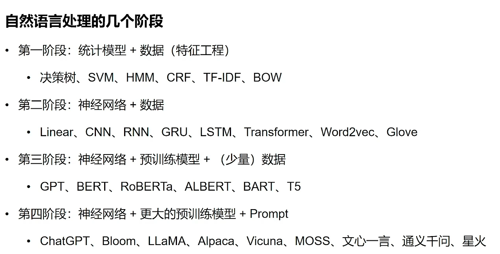
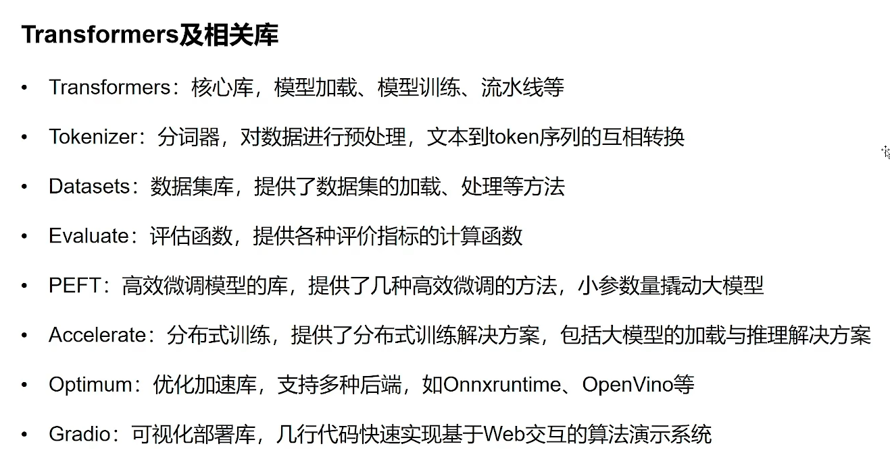
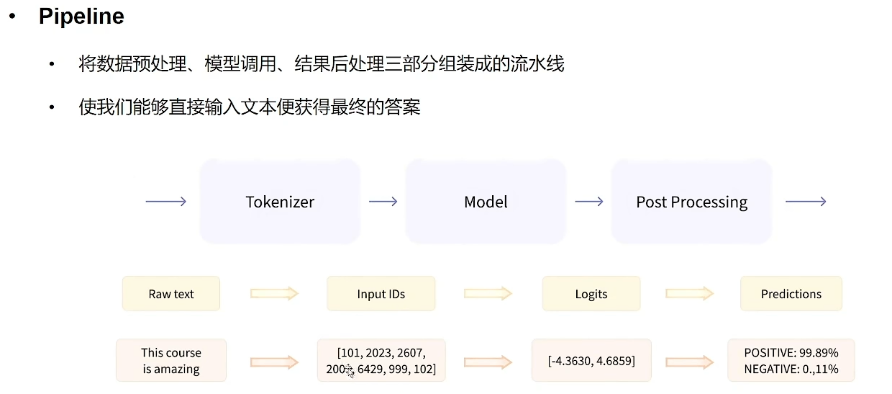
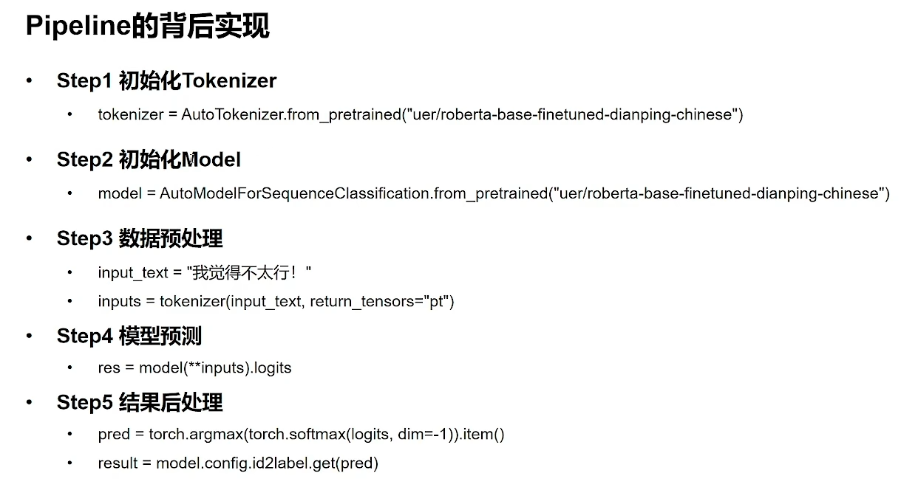
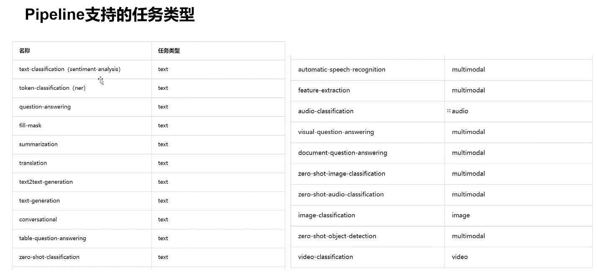
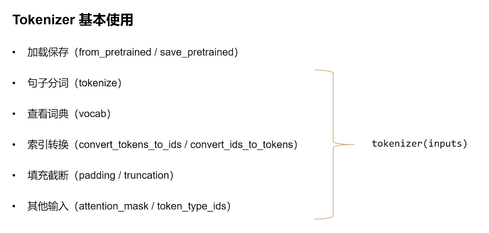
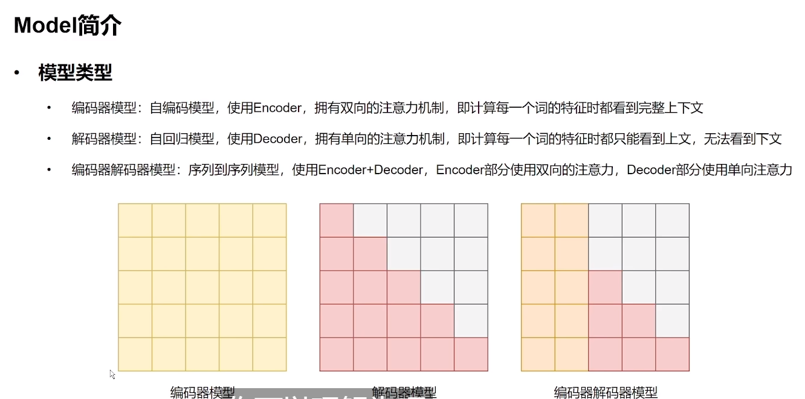

# 抱抱 Transformers







## Pipeline









## Tokenizer



```py
from transformers import AutoTokenizer

sen = "弱小的我也有大梦想!"


# 从HuggingFace加载，输入模型名称，即可加载对于的分词器
tokenizer = AutoTokenizer.from_pretrained("uer/roberta-base-finetuned-dianping-chinese")

# tokenizer 保存到本地
tokenizer.save_pretrained("./roberta_tokenizer")

# 从本地加载tokenizer
tokenizer = AutoTokenizer.from_pretrained("./roberta_tokenizer/")

# 分词
tokens = tokenizer.tokenize(sen)
# ['弱', '小', '的', '我', '也', '有', '大', '梦', '想', '!']

# 查看词典
tokenizer.vocab
tokenizer.vocab_size

# 将词序列转换为id序列
ids = tokenizer.convert_tokens_to_ids(tokens)
# [2483, 2207, 4638, 2769, 738, 3300, 1920, 3457, 2682, 106]

# 将id序列转换为token序列
tokens = tokenizer.convert_ids_to_tokens(ids)
# ['弱', '小', '的', '我', '也', '有', '大', '梦', '想', '!']

# 将token序列转换为string
str_sen = tokenizer.convert_tokens_to_string(tokens)
# '弱 小 的 我 也 有 大 梦 想!'


# 更简单的方式
# 将字符串转换为id序列，又称之为编码
ids = tokenizer.encode(sen, add_special_tokens=True)
# [101, 2483, 2207, 4638, 2769, 738, 3300, 1920, 3457, 2682, 106, 102]

# 将id序列转换为字符串，又称之为解码
str_sen = tokenizer.decode(ids, skip_special_tokens=False)
# '[CLS] 弱 小 的 我 也 有 大 梦 想! [SEP]'


# 填充
ids = tokenizer.encode(sen, padding="max_length", max_length=15)
# [101, 2483, 2207, 4638, 2769, 738, 3300, 1920, 3457, 2682, 106, 102, 0, 0, 0]

# 截断
ids = tokenizer.encode(sen, max_length=5, truncation=True)
# [101, 2483, 2207, 4638, 102]

# attention_mask（区别是否填充） 和 toke_type_id(区别两个句子) 的写法，但一般不需要自己写
attention_mask = [1 if idx != 0 else 0 for idx in ids]
token_type_ids = [0] * len(ids)

# 使用encode_plus方法可以将mask和ids都自动生成出来
inputs = tokenizer.encode_plus(sen, padding="max_length", max_length=15)
# {'input_ids': [101, 2483, 2207, 4638, 2769, 738, 3300, 1920, 3457, 2682, 106, 102, 0, 0, 0], 'token_type_ids': [0, 0, 0, 0, 0, 0, 0, 0, 0, 0, 0, 0, 0, 0, 0], 'attention_mask': [1, 1, 1, 1, 1, 1, 1, 1, 1, 1, 1, 1, 0, 0, 0]}

# 直接使用tokenizer也是一样的，结果如上
inputs = tokenizer(sen, padding="max_length", max_length=15)
```

处理batch

```py
sens = ["弱小的我也有大梦想",
        "有梦想谁都了不起",
        "追逐梦想的心，比梦想本身，更可贵"]
res = tokenizer(sens)
```

```json
{
    'input_ids': [[101, 2483, 2207, 4638, 2769, 738, 3300, 1920, 3457, 2682, 102], 
                  [101, 3300, 3457, 2682, 6443, 6963, 749, 679, 6629, 102], 
                  [101, 6841, 6852, 3457, 2682, 4638, 2552, 8024, 3683, 3457, 2682, 3315, 6716, 8024, 3291, 1377, 6586, 102]], 
    'token_type_ids': [[0, 0, 0, 0, 0, 0, 0, 0, 0, 0, 0], 
                       [0, 0, 0, 0, 0, 0, 0, 0, 0, 0], 
                       [0, 0, 0, 0, 0, 0, 0, 0, 0, 0, 0, 0, 0, 0, 0, 0, 0, 0]], 
    'attention_mask': [[1, 1, 1, 1, 1, 1, 1, 1, 1, 1, 1], 
                       [1, 1, 1, 1, 1, 1, 1, 1, 1, 1], 
                       [1, 1, 1, 1, 1, 1, 1, 1, 1, 1, 1, 1, 1, 1, 1, 1, 1, 1]]}
```

Fast 和 Slow Tokenizer

Fast：基于Rust，更快，还会生成些其他数据

Slow：基于python，更慢

```py
inputs = fast_tokenizer(sen, return_offsets_mapping=True)
```

```json
{
    'input_ids': [101, 2483, 2207, 4638, 2769, 738, 3300, 1920, 10252, 8221, 106, 102], 
    'token_type_ids': [0, 0, 0, 0, 0, 0, 0, 0, 0, 0, 0, 0], 
    'attention_mask': [1, 1, 1, 1, 1, 1, 1, 1, 1, 1, 1, 1], 
    'offset_mapping': [(0, 0), (0, 1), (1, 2), (2, 3), (3, 4), (4, 5), (5, 6), (6, 7), (7, 12), (12, 15), (15, 16), (0, 0)]}
```

offset_mapping：每个词的开始index和末尾index

```py
inputs.word_ids()
```

```json
[None, 0, 1, 2, 3, 4, 5, 6, 7, 7, 8, None]
```


```py
# 加载外部模型，新版本的transformers（>4.34），加载 THUDM/chatglm 会报错，因此这里替换为了天宫的模型
tokenizer = AutoTokenizer.from_pretrained("Skywork/Skywork-13B-base", trust_remote_code=True)
```


## Model

 

```py
model = AutoModel()
```

