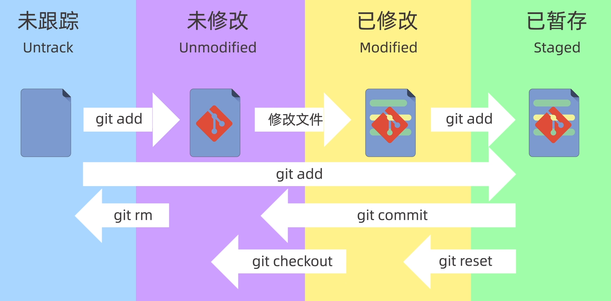

# Git

查看git版本

```bash
# v小写
git -v
git --version
```

```markdown
git version 2.43.0.windows.1
```


文件状态

| 状态        | 描述                   |
| ----------- | ---------------------- |
| main/master | 默认主分支             |
| origin      | 默认远程仓库           |
| HEAD        | 指向当前分支的指针     |
| HEAD^       | 上一个版本             |
| HEAD~       | 上一个版本（不加数字） |
| HEAD~3      | HEAD之前3个版本        |


## config

查看全局配置

```bash
git config --global --list
```


修改用户名和密码

```bash
git config --global user.name "thh-zbb"
git config --global user.email 1725874476@qq.com
git config --global user.password "thh10086"
# 存储配置
git config --global credential.helper store
```


修改代理

```bash
# 格式就是: git config --global http.proxy IP:端口
git config --global http.proxy 127.0.0.1:7890

# 注意：如果是需要身份验证的，就用这种格式：
git config --global http.proxy 用户名:密码@IP:端口

# 如果需要设置https，那么就需要把 http.proxy 改成 https.proxy
git config --global https.proxy 127.0.0.1:7890

# 取消设置代理（不用代理）
git config --global --unset http.proxy
git config --global --unset https.proxy
```


## 创建仓库

初始化一个新的仓库

```bash
git init rep-name
```

从远端服务器克隆一个过来

```bash
git clone https://github.com/thh-zbb/blog.git
```


## 工作区域

* 工作区：working Directory
* 暂存区：Staging Area/Index
* 本地仓库： Local Repository


状态：

* Untrack 未跟踪：还没被git管理的文件
* Unmodified 未修改
* Modified 已修改
* Staged 已暂存




查看仓库状态

```bash
git status
```

On branch main
Your branch is up to date with 'origin/main'.

Changes to be committed:
  (use "git restore --staged \<file\>..." to unstage)
        <span style="color: green;">new file:   test/file1.txt</span>

Untracked files:
  (use "git add \<file\>..." to include in what will be committed)
        <span style="color: red;">test/file2.txt</span>


<span style="color: red;">红色</span>：代表还未跟踪的文件

<span style="color: green;">绿色</span>：在暂存区的文件

已经提交的文件不显示在这里


## 添加暂存文件 (git add)

```bash
# 添加单个文件到暂存区
git add test/file.txt
# 添加当前文件的所有文件到暂存区
git add .
# 添加所有txt文件
git add *.txt

# 如果后悔了，将文件从暂存区取出来
git restore --staged <file>
```


## 提交文件 (git commit)

```bash
git commit -m "message:备注内容"
# -a: 同时完成添加暂存和提交
git commit -a -m "message:同时完成添加暂存和提交"
git commit -am "message:同时完成添加暂存和提交"
```


查看暂存区文件内容

```bash
git ls-files
```


查看提交清空 (git log)

```bash
# 详细提交日志
git log
```

<span style="color: orange;">commit 545e16561e40d2fc3f38affc4430f66f71b383d8</span> (<span style="color: #00F0F0;">HEAD</span> -> <span style="color: green;">main</span>, <span style="color: #DB431B;">origin/main</span>)
Author: thh-zbb <1725874476@qq.com>
Date:   Mon May 27 14:54:25 2024 +0800

​	message:备注内容

```
# 简短提交日志(一行)
git log --oneline
```

<span style="color: orange;">545e165</span> (<span style="color: #00F0F0;">HEAD</span> -> <span style="color: green;">main</span>, <span style="color: #DB431B;">origin/main</span>) message:备注内容


## 回退版本 (git reset)

* soft
* hard
* mixed (默认)


例子：

<span style="color: orange;">333333</span> (<span style="color: #00F0F0;">HEAD</span> -> <span style="color: green;">main</span>) 添加一个file3(内容file3)

<span style="color: orange;">222222</span> 添加一个file2(内容file2)

<span style="color: orange;">111111</span> 添加一个file1(内容file1)

<span style="color: orange;">000000</span> (<span style="color: #DB431B;">origin/main</span>) 新建文件夹：file

`hard`:

```bash
# 硬回退到版本:111111
git reset --hard 111111
```

* 版本111111中，file1是已经提交状态，所以file1还存在
* 但当前状态对于file2和file3属于是新文件，所以file2和file3都会被`删除`（工作区和暂存区都会被）

`soft`:

```bash
# 软回退到版本：111111
git reset --soft 111111
```

* 不像`hard`，软回退不会删除工作区和暂存区的文件

`mixed`:

```bash
# 混合回退版本
git reset --mixed 111111
```

* 删除暂存区的文件，不动工作区的文件


## 查看差异 (git diff)


 默认比较的是`工作区`和`暂存区`之间的差异内容

```bash
git diff
```

查看`工作区`和`版本库`之间的差异

 ```bash
 git diff HEAD
 ```

查看`暂存区`和`版本库`之间的差异

```bash
git diff --cached
git diff --staged
```

 查看两个版本之间的差异

```bash
# 查看版本111111和版本222222之间的差异
git diff 111111 222222
# 查看上一个版本和当前版本的差异
git diff HEAD~ HEAD
git diff HEAD^ HEAD
# 查看3个前的版本和当前版本的差异
git diff HEAD~3 HEAD
```

查看文件不同版本的差异

```bash
# 查看file.txt在当前版本和上一个版本的差异
git diff HEAD^ HEAD file.txt
```

查看两个分支之间的差异

```bash
git diff brach_name1 branch_name2
```


## 删除文件 (git rm)

直接删除

```bash
# 只是删除了工作区的文件，暂存区的文件还存在
rm file.txt
# 需要更新一下暂存区的内容
git add/rm file.txt
```

git 删除

```bash
# git rm删除会将工作区和暂存区的一起删除
git rm file.txt
```

```bash
# 从暂存区删除，保留工作区文件
git rm --cached file.txt
```

```bash
# 递归删除某个目录下的所有子目录和文件
git rm -r *
```

不管用哪个方式删除，都记得得提交一下，不然版本库中还会存在文件

```bash
git commit -m "delete message"
```


## 忽略文件 (.gitigmore)

应该忽略的文件类型

* 系统或者软件自动生成的文件
* 编译产生的中间文件和结果文件
* 运行时生成日志文件、缓存文件、临时文件
* 设计身份、密码、口令、密钥等敏感信息文件

写法

```markdown
# #符号代表备注
# 直接写文件名字
file.log
# 通配符匹配
*.log
```

* \* : 多个字符
* ? : 单个字符
* [abc] : a 或 b 或 c
* \*\* : 任意中间目录
* [0-9] : 0到9
  * [a-z] : 小写a到小写z

例子

```markdown
# 忽略所有的 .a 文件
*.a

# 虽然忽略所有的 .a 文件，但是保留lib.a
!lib.a

# 只忽略当前目录下的 TODO文件夹
/TODO

# 忽略任意目录下名为 build 的文件夹
build/

# 忽略 doc/notes.txt 但不忽略 doc/server/arch.txt
doc/*.txt

# 忽略 doc/ 目录及其所有子目录下的 .pdf 文件
doc/**/*.pdf
```

模板

http://github.com/github/gitignore


与远程仓库绑定 (git remote)

```bash
# 添加远程仓库并设置别名（origin）
git remote add origin git@github.com:***.git

# 查看本地的远程仓库配置
git remote -v

# 指定默认分支的名称为main
git branch -M main

# 把本地仓库的main分支推送到远程origin的main分支
git push -u origin main:main
# 把远程仓库的main分支拉取到本地仓库（使用pull可能会导致冲突，可以使用fetch只获取修改内容）
git pull origin main:main
```


## 分支 (branch)

默认分支：main (以前是master，因为有歧视意味，后来改成了main)

```bash
# 创建新分支
git branch dev
# 切换分支(更推荐switch，因为checkout在恢复文件时可能有歧义)
git checkout dev
git switch dev
# 合并分支 (将dev分支合并到当前分支)
git merge dev
# 删除分支(-d:删除已经合并的分支，-D:强制删除未合并过的分支)
git branch -d dev
git branch -D dev

# 查看分支图
git log --graph --oneline --decorate --all
```


合并 (merge)

```bash
# 合并分支 (将dev分支合并到当前分支)
git merge dev
```

解决冲突

```bash
# 查看冲突文件列表（both modified）
git status
git diff
# 手工编辑文件，将里面的左右箭头删掉，修改成合并后的内容
vi file.txt
# 再提交一遍
git commit -am "merge"

# 中断合并
git merge --abort
```


变基 (rebase)

```bash
git rebase <branch-name>
```

rebase的时候会找到`当前分支`和`目标分支`的共同祖先结点，然后将`当前分支`到共同祖先结点之间的所有结点一直到`目标结点`上

 


# github

## ssh

查看SSH状态

```bash
ssh -T git@github.com
```

生成ssh-key

```bash
ssh-keygen -t rsa -C "邮箱"
# 之后直接3个回车就好了
```

将生成的文件 `id_rsa.pub`内容复制到github中，`id_rsa`不动


添加orgin

```bash
git branch -M main
git remote add origin git@github.com:***.git
git push -u origin main
```

