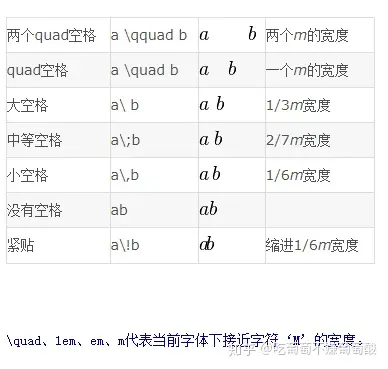

# markdown 笔记

https://www.cnblogs.com/beyondChan/p/11394854.html


## 公式

段前和断后使用 

\$\$

公式内容

\$\$


##### 公式标记

```latex
\begin{align*}
y = x \tag{1} \\
y = x^2 \tag{2} \\
\end{align*}
```


$$
\begin{align*}
y = x \tag{1} \\
y = x^2 \tag{2} \\
\end{align*}
$$

* `align`: 对齐公式

* `\tag`: 公式后面的标记

左对齐
$$
\begin{align*}
& y = x \tag{1} \\
& y = x^2 \tag{2} \\
\end{align*}
$$

* &: 指示每行公式的起始位置


## 矩阵写法

* matrix
* pmatrix 圆括号矩阵 (parenthesis)
* bmatrix 方括号矩阵 (bracket)
* vmatrix 竖线矩阵 (vertical line)
* Vmatrix 双竖线矩阵

普通矩阵 `matrix`
$$
\begin{matrix}
a & b \\
c & d \\
\end{matrix}
$$


圆括号矩阵 `pmatrix`
$$
\begin{pmatrix}
a & b \\
c & d \\
\end{pmatrix}
$$


方括号矩阵 `bmatrix`
$$
\begin{bmatrix}
a & b \\
c & d \\
\end{bmatrix}

\tag{1}
$$


竖线矩阵 `vmatrix`
$$
\begin{vmatrix}
a & b \\
c & d \\
\end{vmatrix}
$$


双竖线矩阵 `Vmatrix`
$$
\begin{Vmatrix}
a & b \\
c & d \\
\end{Vmatrix}
$$


## 省略号

* 行省略` \ldot`s或`\cdot`s (line)
* 列省略 `\vdots` (vertical)
* 对角省略 `\ddots` (diagonal)

$$
\begin{pmatrix}
a_{11} & a_{12} & \cdots & a_{1n} \\
a_{21} & a_{22} & \ldots & a_{2n} \\
\vdots & \vdots & \ddots & \vdots \\
a_{m1} & a_{m2} & \ldots & a_{mn} \\
\end{pmatrix}
$$


## 常用符号

### yhat ŷ

$$
\hat{y}
$$


### 多项相加 Σ


$$
\sum_{i=1}^{n} i
$$


## 希腊字母

| 字母 | 实现       | 字母 | 实现       |
| ---- | ---------- | ---- | ---------- |
| A    | `A`        | α    | `\alhpa`   |
| B    | `B`        | β    | `\beta`    |
| Γ    | `\Gamma`   | γ    | `\gamma`   |
| Δ    | `\Delta`   | δ    | `\delta`   |
| E    | `E`        | ϵ    | `\epsilon` |
| Z    | `Z`        | ζ    | `\zeta`    |
| H    | `H`        | η    | `\eta`     |
| Θ    | `\Theta`   | θ    | `\theta`   |
| I    | `I`        | ι    | `\iota`    |
| K    | `K`        | κ    | `\kappa`   |
| Λ    | `\Lambda`  | λ    | `\lambda`  |
| M    | `M`        | μ    | `\mu`      |
| N    | `N`        | ν    | `\nu`      |
| Ξ    | `\Xi`      | ξ    | `\xi`      |
| O    | `O`        | ο    | `\omicron` |
| Π    | `\Pi`      | π    | `\pi`      |
| P    | `P`        | ρ    | `\rho`     |
| Σ    | `\Sigma`   | σ    | `\sigma`   |
| T    | `T`        | τ    | `\tau`     |
| Υ    | `\Upsilon` | υ    | `\upsilon` |
| Φ    | `\Phi`     | ϕ    | `\phi`     |
| X    | `X`        | χ    | `\chi`     |
| Ψ    | `\Psi`     | ψ    | `\psi`     |
| Ω    | `\v`       | ω    | `\omega`   |


$$
偏导： \partial
$$


### 大括号

$$
方法一：
f(x)=\left\{
\begin{aligned}
x & = & \cos(t) \\
y & = & \sin(t) \\
z & = & \frac xy
\end{aligned}
\right.


\\\\
方法二：
 F^{HLLC}=\left\{
\begin{array}{rcl}
F_L       &      & {0      <      S_L}\\
F^*_L     &      & {S_L \leq 0 < S_M}\\
F^*_R     &      & {S_M \leq 0 < S_R}\\
F_R       &      & {S_R \leq 0}
\end{array} \right. 

\\\\
方法三:
f(x)=
\begin{cases}
0& \text{x=0}\\
1& \text{x!=0}
\end{cases}
$$


### 空格




## **四则运算**

1. 加法运算，符号：`+`，如：x+y=z𝑥+𝑦=𝑧
2. 减法运算，符号：`-`，如：x−y=z𝑥−𝑦=𝑧
3. 加减运算，符号：`\pm`，如：x±y=z𝑥±𝑦=𝑧
4. 减甲运算，符号：`\mp`，如：x∓y=z𝑥∓𝑦=𝑧
5. 乘法运算，符号：`\times`，如：x×y=z𝑥×𝑦=𝑧
6. 点乘运算，符号：`\cdot`，如：x⋅y=z𝑥⋅𝑦=𝑧
7. 星乘运算，符号：`\ast`，如：x∗y=z𝑥∗𝑦=𝑧
8. 除法运算，符号：`\div`，如：x÷y=z𝑥÷𝑦=𝑧
9. 斜法运算，符号：`/`，如：x/y=z𝑥/𝑦=𝑧
10. 分式表示，符号：`\frac{分子}{分母}`，如：x+yy+z𝑥+𝑦𝑦+𝑧
11. 分式表示，符号：`{分子} \voer {分母}`，如：x+yy+z𝑥+𝑦𝑦+𝑧
12. 绝对值表示，符号：`||`，如：|x+y|


### 文本颜色

$$
\textcolor{#FF0000}{f_1}*3
\\
\textcolor{green}{f_2}
$$


#### 上下标

X<sub>1</sub>

a<sup>2</sup>