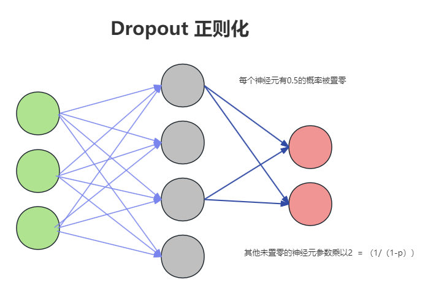

# pytorch教程


```python
import torch
import torch.nn as nn
```


## nn

### 数据结构

#### nn.Parameter

用于定义模型中需要学习的参数

为什么使用 `nn.Parameter`

- 显式声明参数：通过 `nn.Parameter` 可以显式地声明模型的参数，这对于理解模型结构和调试非常有帮助。
- 自动优化：将张量包装为 `nn.Parameter` 后，优化器会自动识别这些参数并在训练过程中更新它们的值。


#### nn.ModuleList

pytorch中的一个容器，类似于数组，专门存储`nn.Module`。这使得列表中的所有模块能够被正确地注册，并且在调用 `model.to(device)` 时可以一起转移到指定的设备上（如 GPU）。


### 网络

#### nn.Embedding

```python
nn.Embedding(num_embeddings, embedding_dim, padding_idx=None, max_norm=None, norm_type=2.0, scale_grad_by_freq=False, sparse=False, _weight=None)
```

- `num_embeddings` ([*int*](https://docs.python.org/3/library/functions.html#int)) –  词汇表的大小，或者说嵌入字典的大小。这通常是输入词汇表中唯一标识符（如词汇表中的单词）的数量。
- `embedding_dim` ([*int*](https://docs.python.org/3/library/functions.html#int)) – 每个词的维度 (一般是512)
- `padding_idx` ([*int*](https://docs.python.org/3/library/functions.html#int)*,* *可选*) – 如果提供，该索引将在嵌入查找期间始终输出全零向量。这通常用于处理填充标记。
- `max_norm` ([*float*](https://docs.python.org/3/library/functions.html#float)*,* *可选*) – 如果提供，将对每个嵌入向量进行最大范数约束。如果嵌入向量的范数超过此值，将其归一化到此值
- `norm_type` ([*float*](https://docs.python.org/3/library/functions.html#float)*,* *可选*) – 用于计算最大范数约束的范数类型（默认是2范数，即欧几里德范数）
- `scale_grad_by_freq` ([*bool*](https://docs.python.org/3/library/functions.html#bool)*,* *optional*) – 如果设置为 `True`，则梯度将按频率进行缩放。这对于大规模分类任务中加速训练有时会有帮助
- `sparse` ([*bool*](https://docs.python.org/3/library/functions.html#bool)*,* *可选*) – 如果设置为 `True`，则会使用稀疏梯度更新。这对于非常大的嵌入字典有助于减少内存消耗。

* `_weight` ([*Tensor 或 Nome*](https://docs.python.org/3/library/functions.html#Tensor)) - 初始的嵌入权重。如果提供，`num_embeddings` 和 `embedding_dim` 将从 `_weight` 的形状中推断

**代码**

```python
import torch
import torch.nn as nn

vocab_size = 10000	# 词汇表中有10000个词
embedding_dim = 300	# 每个词的维度是300

# 创建嵌入层
embedding = nn.Embedding(vocab_size, embedding_dim)

input_indices = torch.tensor([1, 2, 3, 4, 5], dtype=torch.long)

embedding_vectors = embedding(input_indices)

print("输入索引:", input_indices)
print("嵌入向量:", embedding_vectors)
```


#### nn.Dropout



是实现 dropout 正则化的模块。防止过拟合。通过在训练过程中随机地将部分神经元的输出置零来实现。这样可以减少神经元之间的相互依赖，从而增强模型的泛化能力。

在训练过程中，Dropout 会以一定的概率 ppp （通常为 0.5）随机地将输入张量的一部分元素置零，同时将未置零的元素按 $$ \frac{1}{1-p}$$ (例子中=2，未置零的元素都乘以2) 的比例进行缩放，为了保证在训练和测试时神经网络的总激活值保持一致，从而避免由于 Dropout 导致的输出不稳定。这种操作在每个训练步骤中都是随机的。

使用 `nn.Dropout` 非常简单，只需要在定义模型时将其添加到网络结构中即可。在前向传播过程中，Dropout 会自动生效。

**代码**

```python
import torch
import torch.nn as nn
import torch.optim as optim

# 定义一个简单的神经网络
class SimpleNet(nn.Module):
    def __init__(self, input_size, hidden_size, output_size, dropout_prob):
        super(SimpleNet, self).__init__()
        self.fc1 = nn.Linear(input_size, hidden_size)
        self.dropout = nn.Dropout(dropout_prob)
        self.fc2 = nn.Linear(hidden_size, output_size)

    def forward(self, x):
        x = torch.relu(self.fc1(x))
        x = self.dropout(x)  # 在隐藏层之后应用 Dropout
        x = self.fc2(x)
        return x

# 超参数
input_size = 3
hidden_size = 4
output_size = 2
dropout_prob = 0.5  # Dropout 概率

# 创建模型实例
model = SimpleNet(input_size, hidden_size, output_size, dropout_prob)

# 打印模型结构
print(model)

# 创建一个输入张量
input_tensor = torch.randn(5, input_size)

# 前向传播
output = model(input_tensor)
print("Output:", output)

# 定义损失函数和优化器
criterion = nn.MSELoss()
optimizer = optim.Adam(model.parameters(), lr=0.001)

# 模拟一个训练步骤
model.train()  # 训练模式
optimizer.zero_grad()
output = model(input_tensor)
target = torch.randn(5, output_size)
loss = criterion(output, target)
loss.backward()
optimizer.step()

```


### 方法

#### transpose 交换

```py
# 交换i j维度的位置
torch.transpose(i,j)
```


#### contiguous 连接

在 PyTorch 中，`contiguous()` 方法用于返回一个连续存储的张量副本。由于某些操作（如 `transpose`）不会改变数据在内存中的存储顺序，可能导致张量在内存中变得不连续。如果需要对张量进行 `view` 操作（即改变张量的形状），需要确保张量是连续存储的。

可以理解为：只改变了逻辑结构，没有改变物理结构，需要重新更新一下内容，搬个家。


#### unsqueeze 插入

用于在指定位置插入一个大小为1的新维度的函数。

```python
torch.unsqueeze(input, dim)
```

`input`：需要扩展维度的张量。

`dim`：指定在哪个位置插入新的维度（维度索引从0开始）。

**代码**

```python
import torch

# 创建一个形状为 (3, 4) 的张量
tensor = torch.randn(3, 4)
# torch.Size([3,4])
print("原始张量形状:", tensor.shape)

# 在维度 1 上进行 unsqueeze 操作
unsqueezed_tensor = torch.unsqueeze(tensor, 1)
# torch.Size([3,1,4])
print("在维度 1 上 unsqueeze 后的张量形状:", unsqueezed_tensor.shape)
```


## F

### 方法

#### log_softmax

将输入张量进行softmax操作，然后再对结果取对数。

softmax操作将每个元素转换为一个介于0和1之间的值，并且相加为1，表示该元素在归一化后的概率。log softmax操作则将这些概率取对数，这在数值计算中更稳定，通常用于分类任务的损失函数计算，比如交叉熵损失。

**公式**

softmax
$$
softmax(x_i) = \frac{e^{x_i}}{\sum_je^{x_i}}
$$
log_softmax
$$
log_softmax(x_i) = log(\frac{e^{x_i}}{\sum_je^{x_i}})
$$


```py
import torch
import torch.nn.functional as F

input_tensor = torch.tensor([[1.0,2.0,3.0],[4.0,5.0,6.0]])  # 假设输入张量的形状为(2, 3)
log_softmax_output = F.softmax(input_tensor, dim=-1)
```

`dim=1`（dim=-1）表示沿着第二个维度（即沿着列方向, 对着每行）,进行log softmax操作

```
tensor([[0.0900, 0.2447, 0.6652],
        [0.0900, 0.2447, 0.6652]])
```

如果dim=0，表示沿着行对列进行softmax

```
tensor([[0.0474, 0.0474, 0.0474],
        [0.9526, 0.9526, 0.9526]])
```

