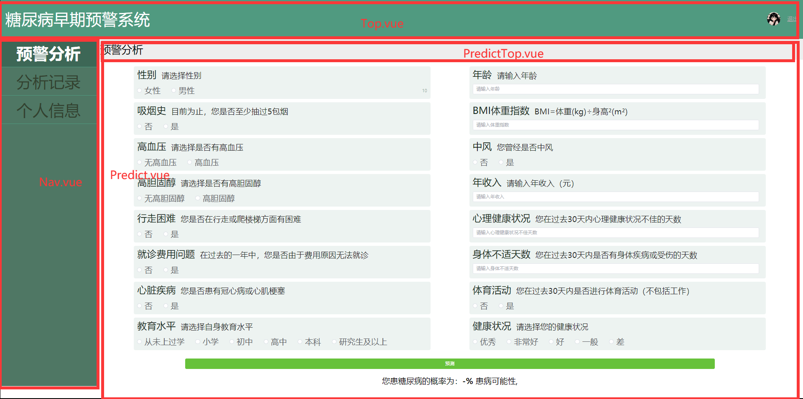

### 问题总结

#### 你这个系统用的什么（框架/库）做的？

用的vue（是一种[渐进式](# 渐进式)框架，[组件式](# 组件式)开发）,页面设计使用了`element-plus`库。

#### 用的什么工具开发？

用的`VS code`（读音：v s code     全程： visual studio code）

#### 使用的什么数据库？

我们没有使用数据库，登录和注册功能是将账号密码当成**变量**存储在项目里。

具体：为了简单，我们将账号和密码固定，比如我们的账号固定为”shujujianmo“，密码固定为：”123456“，每次输入时判定账号是否为”shujujianmo“，密码是否为”123456“，如果都符合则跳转到预测页面。不符合就提示账号密码错误（这个功能没写，你就说忘了弄）

#### 你们的预测是用什么方式预测的？

我们首先通过python训练，并得到训练后的model变量，通过`joblib`库将模型变量存储成文件。

服务器使用`flask`库创建，给前端提供预测接口”/predict“

前端（也就是vue应用），使用`axios`库通过http协议请求后端提供的接口，通过向后端传输用户输入的数据，后端接收到数据后用model变量进行预测。并将预测结果返回给前端，前端接收到后显示出来。

（`axios`是一个通过http协议请求访问后端的一个vue库）

#### 菜单跳转怎么实现的？

使用了`router`库，每次点击菜单后就替换中间最主要的那块内容，导航栏和顶部不动。

#### 万能回答

不好意思老师，我们之前没有学过这个，都是需要用到什么学什么，所以不是很熟悉

##### 渐进式

意思是可以逐步采用。可以不用使用全部功能，也可以使用其他的库完成功能。

比如Vue就是一个大框架，里面使用了许多库：

* 使用了`router`进行页面跳转功能
* 使用了`element-plus`库里面的好看的组件（输入框、按钮等）

##### 组件式

vue开发的页面都是一个一个的组件（component），比如我们的预警页面，其实就是Top组件 + Nav组件 + Predict组件

所以组件式开发就相当于搭积木或者拼图，这样更加**灵活**，开发更加**清晰简单**。

