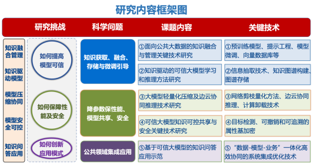
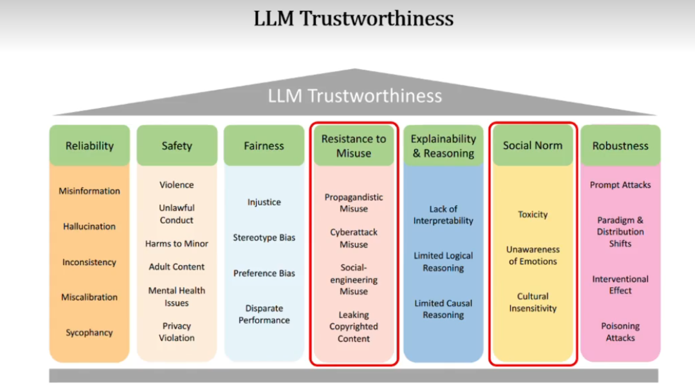

# 学习内容和目标总结

## 学习目标

* 英语
  * 论文专业英语
  * 六级
* AI
  * 桌面助手
    * 具有360°视觉，听觉和其他感知，可以行动、说话、显示等功能。

* 吉他
* 电子琴
* 种花

## 学习内容总结（未分类）

### Seaborn

https://seaborn.pydata.org/examples/

python，Seaborn 是一个强大的数据可视化工具，通过简洁的接口和丰富的功能，可以帮助用户更轻松地进行数据分析和展示。

## 学习目标总结

### 面向公共大数据的可信大模型关键技术研究与应用

可信问题：

* 宣传滥用 propagandistic misuse
  * 编造恶意谣言
  * 给恐怖组织撰写宣传语
  * 生成有害的政治言论
* 网络攻击滥用 cyberattack misuse
  * 生成网络攻击代码 （例DDoS）
* 版权保护信息泄露 Leaking Copyrighted Content
* 社会工程上的滥用 Social-engineering Misuse
  * 生成的图片和音频，冒充他人
  * 网络钓鱼、垃圾邮件
  * 生成虚假在线内容

# 学习任务

每日任务：

* 9点前起床
* 每天一篇论文，不一定看完，1h起步
* 英语6级1h
* 电子琴1h
* 吉他1h
* 健身1h
* 11点前睡觉

使用BERT做情绪识别