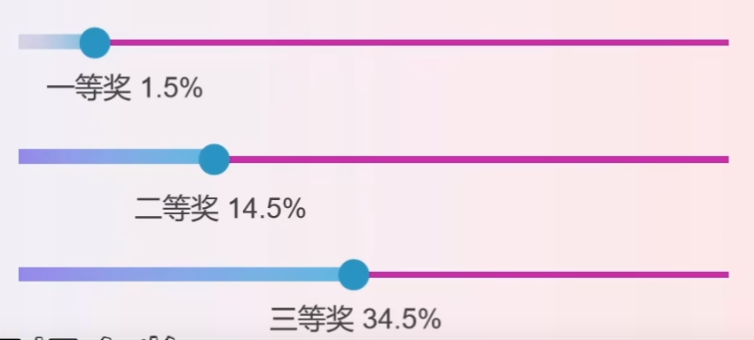

# “华为杯”研究生数学建模竞赛

竞赛设立一、二、三等奖、华为专项奖、数模之星、数模之星提名奖、成功参赛奖、参赛单位优秀组织奖等

总共`34.5%`的人可以得奖，其中：

- 一等奖：`1.5%`
- 二等奖：`13%`
- 三等奖：`20%`

## 题型分布

### 华为专项题（2题）

比较偏工科

2022：

* `A`题：移动场景超分辨定位问题
* `B`题：方形件组批优化问题

### 最优化题目（2题）

比较偏统计

2022：

* `C`题：汽车制造涂装-总装缓存调序区调度优化问题
* `E`题：草原放牧策略研究

### 中兴专项题（1题）

纯工科题目

2022：

* `D`题：PISA架构芯片资源排布问题

### 大数据问题（1题）

绝大部分会选择的问题

2022：

* `F`题：COVID-19 疫情期间生活物资的科学管理问题

## 赛程安排

比赛持续5-6天，最后一天要上传论文和提交代码

## 提前准备

* 历年论文阅读
* 队友任务分配
* 模板格式撰写

### 模板格式

#### 摘要

第一部分：针对问题的背景简单的介绍

第二部分：对每个问题的详细分解，按照问题+流程+模型+结论概括。每个子问题成段书写

第三部分：全文总结，有模板

关键词：背景、算法、模型