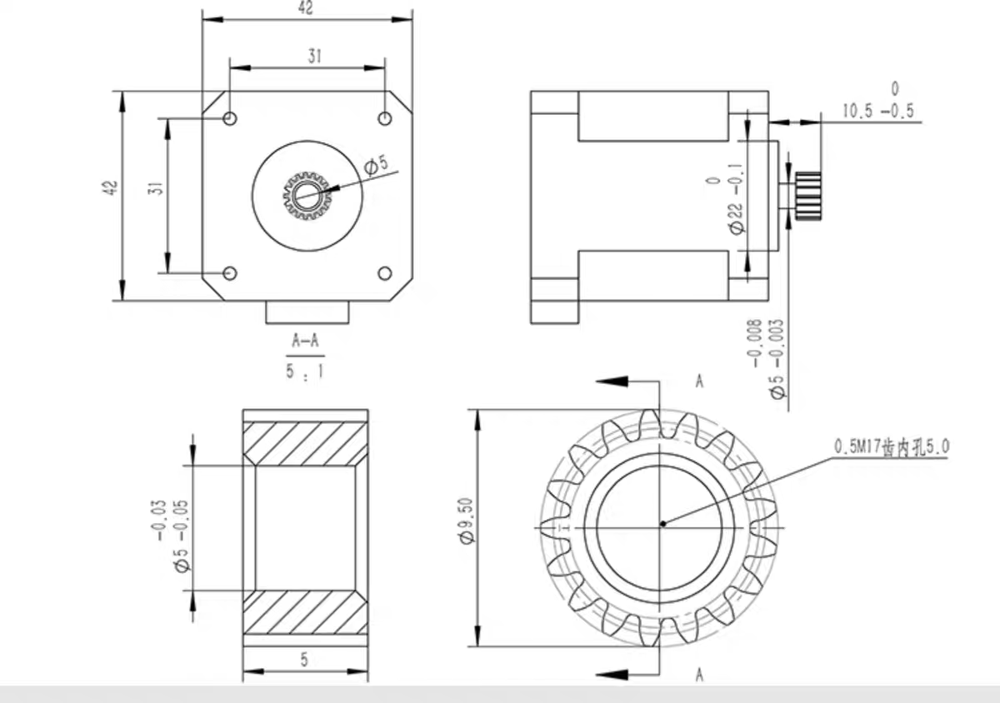

# 机械臂零件数据

## 零件参数

### 步进电机

#### 42步进电机

* 高度
  * 短款： 23.5mm
  * 普通： 38mm
  * 长款： 48mm
* 出轴
  * 直径 5mm
  * 长度 22mm
* 宽度 42mm
* 孔位
  * 位置宽度 31mm
  * 直径大小 3mm
  * 有效深度 5mm
* 凸起
  * 直径 22mm
  * 高度 2mm
* 接口处
  * 宽度 16.2mm
  * 高度 9.2mm
  * 突出 5.5mm

##### 普通款

##### 短款

#### 28步进电机

* 出轴长度：13mm
* 孔距离： 23mm
* 孔径： 3mm

### 行星减速器

* 底座
  * 宽度 42mm
  * 孔位 31mm
* 高度
  * 一级 26.5mm [3.7]
  * 二级 32.5mm [13,7, 19.2]
  * 三级 38.5mm [51, 71, 99.5]
* 圆柱体
  * 直径 36mm
  * 高度
    * 一级 21.5mm [3.7]
    * 二级 27.5mm [13,7, 19.2]
    * 三级 33.5mm [51, 71, 99.5]
* 突起
  * 直径 22mm
  * 高度 2mm
* 出轴
  * 直径 8mm
  * 长度18.5mm
* 固定孔
  * 直径 3mm
  * 深度 4mm
  * 直径 28mm （4个孔位在直径28mm圆圈上）

### 底座电机支架

螺丝

* m3 10mm * 8个 （固定减速器和电机）
* m3 30mm * 4个 （用于固定电机支架于底座上）

### 法兰联轴器

#### 8mm

* 内孔 : 孔径 `8mm`
* d : 外圆柱直径 `16mm`
* h : 圆柱高度 10mm
* D : 底盘直径 `32mm`
* H-h :  底盘厚度 `3mm`
* $$\phi$$ : 底盘固定孔直径 `4mm`
* 顶丝孔 `4mm`
* L : 固定孔直径 `24mm`

#### 5mm

* 内孔 : 孔径 `5mm`
* d : 外圆柱直径 `10mm`
* h : 圆柱高度 10mm
* D : 底盘直径 `22mm`
* H-h :  底盘厚度 `2mm`
* $$\phi$$ : 底盘固定孔直径 `3mm`
* 顶丝孔 `3mm`
* L : 固定孔直径 `16mm`

[法兰联轴器-8mm](./3D/法兰联轴器-8mm.SLDPRT)

### 同步轮

#### 同步轮-2gt-20齿-内孔5

#### 同步轮-2gt-40齿-内孔5

#### 同步轮-2gt-48齿-内孔5

#### 同步轮-2gt-60齿-内孔5

### 同步带

中间间距约为42.5mm时（两个42步进电机紧挨着）

20T-20T : `126mm`

20T-60T : `165mm`

### 螺丝

#### 内六角螺丝

螺母

厚2.4mm