# Emm_V5.0闭环步进电机驱动

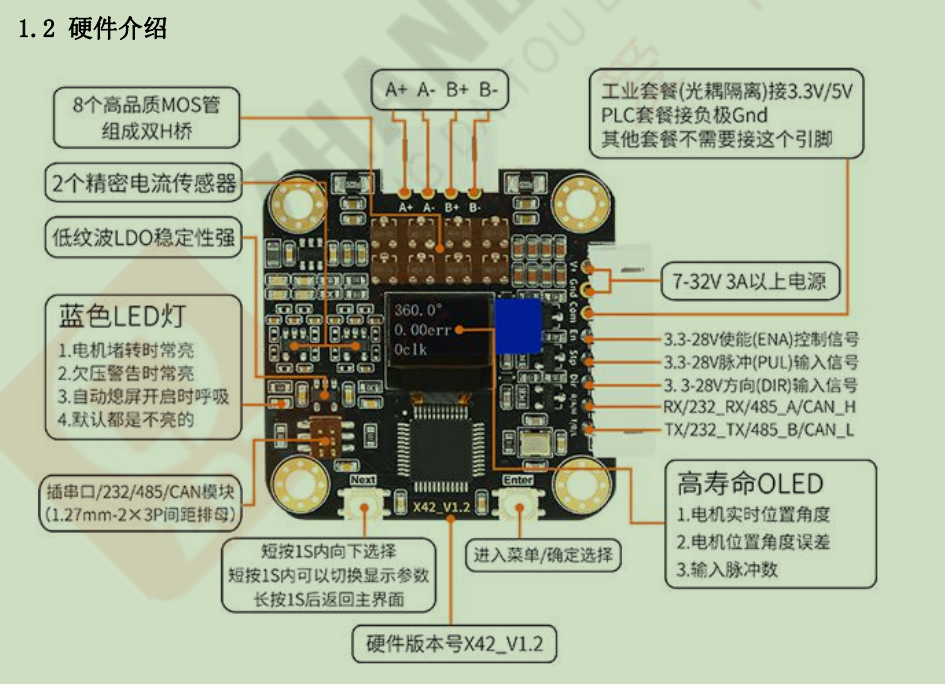

最大电流 3000mA，最高转速 3000RPM+

## 第一次上电自检

可能会出现的错误：

* **提示 1 秒“Not Cal”，然后进入校准菜单（此时只有 6 个菜单项，含 Exit 项）**
  * 原因：未进行校准
  * 没进行过编码器校准的闭环电机只有 6 个菜单项，分别是“Cal”、“MotType”、“P_Pul”、“P_Serial”、“Restore”、“Exit”；
  * 按照电机类型修改`mottype `（0.9/1.8）
  * 设置`P_Pul`脉冲控制端口模式（PUL_OFF关闭 / PUL_OPEN开环 / PUL_FOC闭环 ）ESI_RCO：复用为限位输入和到位输出
  * 设置`P_Serial`通讯端口复用模式：
    * RxTx_OFF：关闭通讯端口，通讯控制无效；
    * ESI_ALO：将 R/A/H 复用为限位开关输入，将 T/B/L 端口复用为报警输出；
    * UART_FUN：将 R/A/H 和 T/B/L 端口复用为串口/RS232/RS485 通讯控制功能；
    * CAN1_MAP：将 R/A/H 和 T/B/L 端口复用为 CAN 通讯控制功能，可用 CAN 通讯控制；
  * 设置`EN`使能模式
    * L： En 端口低电平有效，即 En 端口控制到低电平电机使能，高电平不使能；
    * H： En 端口高电平有效，即 En 端口控制到高电平电机使能，低电平不使能；
    * Hold：En 端口一直有效，即无论 En 端口是高电平还是低电平，电机一直使能；
    * **En 端口在不接线情况下，En 端口默认是 Hold 模式，即一直使能状态；**
  * 设置`dir`转动方向 （cw, ccw）
  * `mstep`细分步数（1、2、4、8、16、32、64、128、256）默认16细分
  * `MPlayer`设置脉冲输入控制下，内部的细分插补功能。使能(Enable)该选项后，驱动器会将你设置的当前细分值，如 16 细分，内部自动插补到最高细分去运行，这将有效的减少电机低速运动时的震动和噪音；
  * `AutoSDD`自动息屏
  * `MA`开环电流，默认1A
  * `MA_Limit`堵转最大电流，默认3A
  * `Op_Limit`闭环模式下的最大输出电压，默认是(5000 * 2)mV。该选项通过限制驱动的最大输出电压，可以近似的限制电机的最高转速。
  * `UartBaud`设置串口/RS232/RS485 通讯的波特率，默认是 115200
  * `CanBaud`设置 CAN 通讯的速率，默认是 500000，即 500KHz
  * `ID_Addr`设置串口/RS232/RS485/CAN 多机通讯时的本机的地址,1-16,其他地址可用串口进行修改(1-255)
  * `Checksum`设置串口/RS232/RS485/CAN 多机通讯时的校验方式（0x6B、XOR、CRC-8、Modbus）
    * 默认为 0x6B,即通讯时每条命令最后一个字节都固定为 0x6B，其他校验的计算方式请查看“通讯控制”章节；Modbus 请查看“Modbus-RTU 指令说明”文档；
  * `Response`设置串口 TTL/RS232/RS485/CAN 通讯控制时控制动作命令列表是否回复。设置串口/RS232/RS485/CAN 总线通讯控制时，主机发送**控制动作命令列表**中的命令时，从机收到命令后，是否返回确认收到命令，以及是否返回到位命令；
  * 
    * None： 不返回确认收到命令，在发送位置模式命令时也不返回到位命令；
    * Receive：只返回确认收到命令（默认值）；
    * Reached：只在发送位置模式命令时返回到位命令（地址 + FD + 9F + 6B）；
    * Both： 既返回确认收到命令，也在发送位置模式命令时返回到位命令；
    * Other： 位置模式下只返回到位命令，其他控制动作命令返回确认收到命令；
  * `S_Vel_IS`修改通讯控制的输入速度是否缩小 10 倍输入（精确到 0.1RPM 输入）。默认通讯控制输入转速最低为 1RPM，将 S_Vel_IS 设置为 Enable 后，则输入的转速会缩小 10 倍，比如发送 1RPM 的转速，但电机实际是以 0.1RPM 的转速运行；
  * `Clog_Pro`
  * 电机发生堵转时，不管该选项是否使能，LED 都会点亮提示；如果使能(Enable)该选项后，堵转时电机将自动关闭驱动器，可以保护电机和驱动器不受堵转大电流的损坏；如果 P_Serial 设置为 ESI_ALM 时，则在触发了堵转保护后，T/B/L 端口将输出 3.3V 高电平，将 R/A/H 引脚接 Gnd（0V）可以复位堵转保护，不需要重新上电；
    * **（堵转保护触发条件：电机实际转速 < 设置的堵转检测转速阈值 + 电机实际相电流 >设置的堵转检测相电流阈值 + 持续时间 > 设置的堵转检测时间阈值）**
  * `Clog_Rpm`置堵转检测的转速阈值 8、16、...、112
  * `Clog_Ma`设置堵转检测的相电流阈值1800、3000、...、3000（单位：Ma）
  * `Clog_Ms`设置堵转检测的时间阈值1000、2000、...、12000（单位：Ms）
  * `O_Mode`设置回零模式。（Nearest、Dir、Senless、EndStop）设置上电自动触发回零的回零模式，分别是单圈就近回零、单圈方向回零、多圈无限位碰撞回零、多圈有限位开关回零。
  * `O_Dir`设置回零方向
  * `O_Vel`设置回零转速
  * `O_Tmo_Ms`设置回零超时时间,回零超过这个时间就自动中断并退出回零，并置位回零失败标志位。
  * `O_Set`设置单圈就近/方向回零的零点位置(Set O、Clear O、Exit)
  * `O_SL_Rpm`设置无限位碰撞回零的检测转速.碰撞回零检测判定条件之一：电机实际转速 < 碰撞回零检测转速
  * `O_SL_Ma`设置无限位碰撞回零的检测电流.碰撞回零检测判定条件之二：电机实际电流 > 碰撞回零检测电流。
  * `O_SL_Ms`设置无限位碰撞回零的检测时间,碰撞回零检测判定条件之三：持续时间 > 碰撞回零检测时间。
  * `O_POT_En`设置上电自动触发回零操作
  * `Restore`恢复出厂设置
  * 上电后选中 Cal 菜单，按 Enter 键确认选择，电机开始校准编码器；电机在“哔”的一声后会慢慢的正转一圈，然后再慢慢的反转一圈；

* **提示“Phase A+ A- Error！”或“Phase B+ B- Error！”或“Phase AA BB Error！”**
  * 电机线序错误；
* **提示“Waiting V+ Power”**
  * 电源电压太低
* **提示“Magnet Loss! Enter..”**
  * 驱动器上的编码器没检测到磁铁；
* **提示“Ref Voltage Error!”或者“Bus Current Error!”**
  * 基准电压芯片故障、电流传感器芯片故障；联系客服

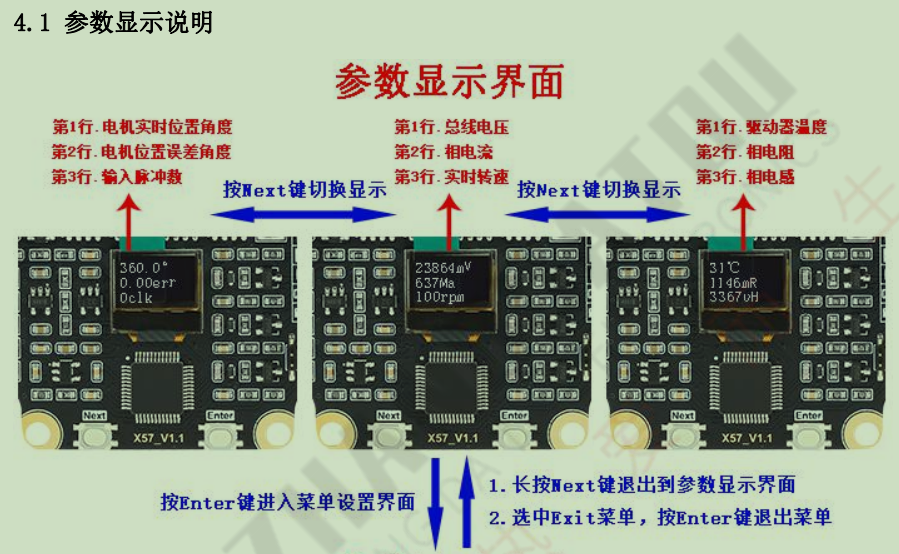

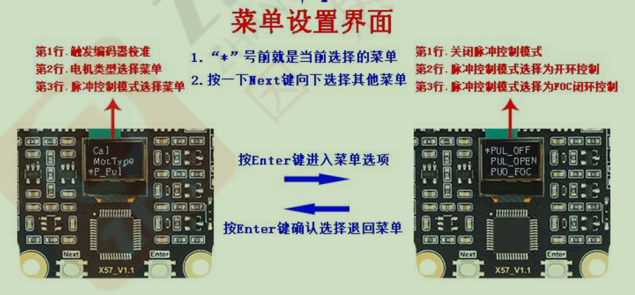

## 控制

### 脉冲控制

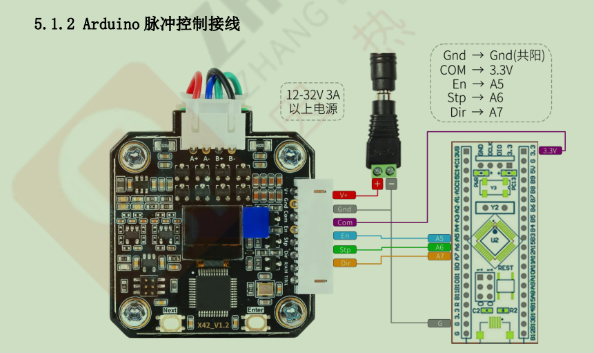

### 通讯控制

#### 串口控制

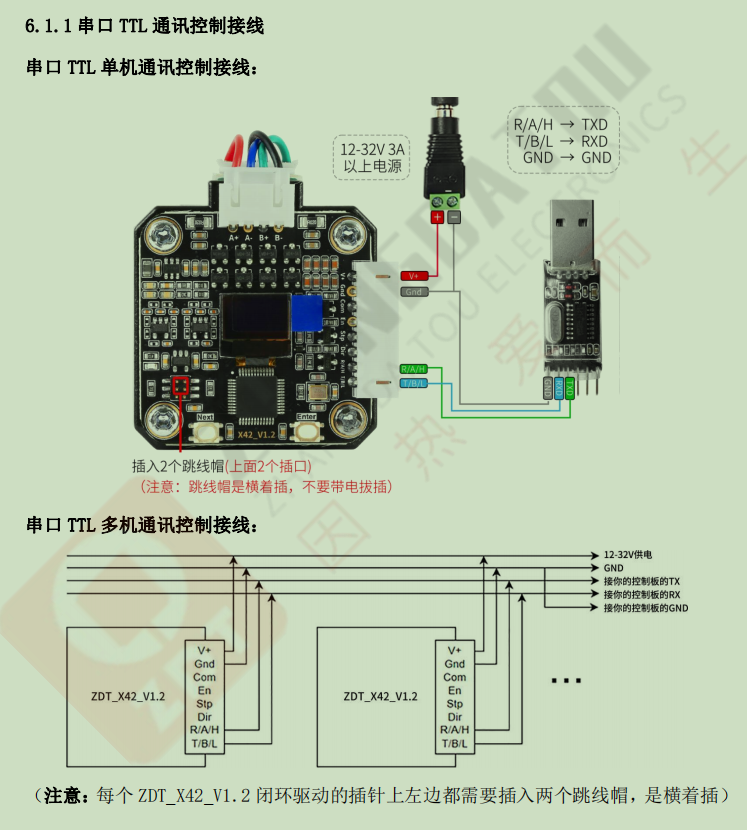

#### can通信

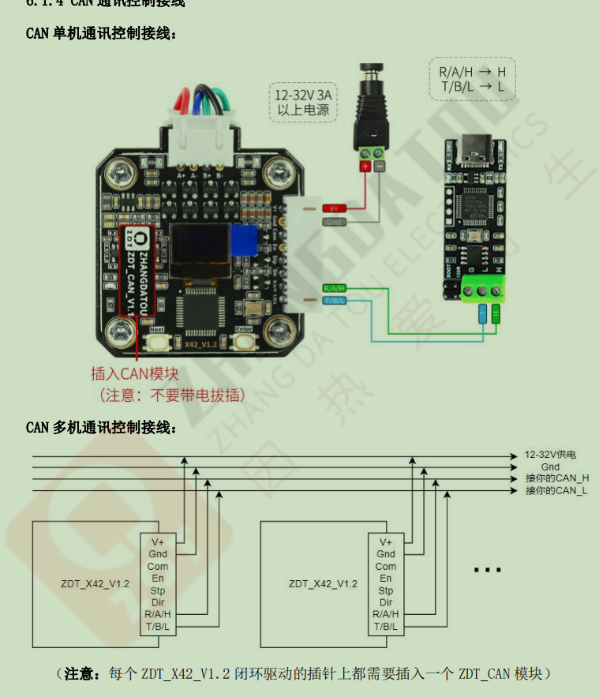

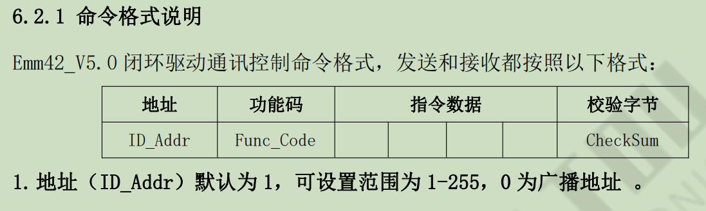

CAN 总线的负载能力理论上最多能够连接 110 个节点

地址 1-10 可以在菜单 ID_Addr 上进行选择修改，大于 10 的地址通过串口/CAN通讯发送命令进行修改。

0 为广播地址，上位机以 0 地址发送命令，则所有的闭环电机都会执行这条命令。

0 为广播地址发送命令时，则只有地址为 1 的电机会回复命令，其他地址不回复

#### 校验

选择 0x6B，意思就是每条命令的最后一个字节都是 0x6B 作为校验；

#### 上位机

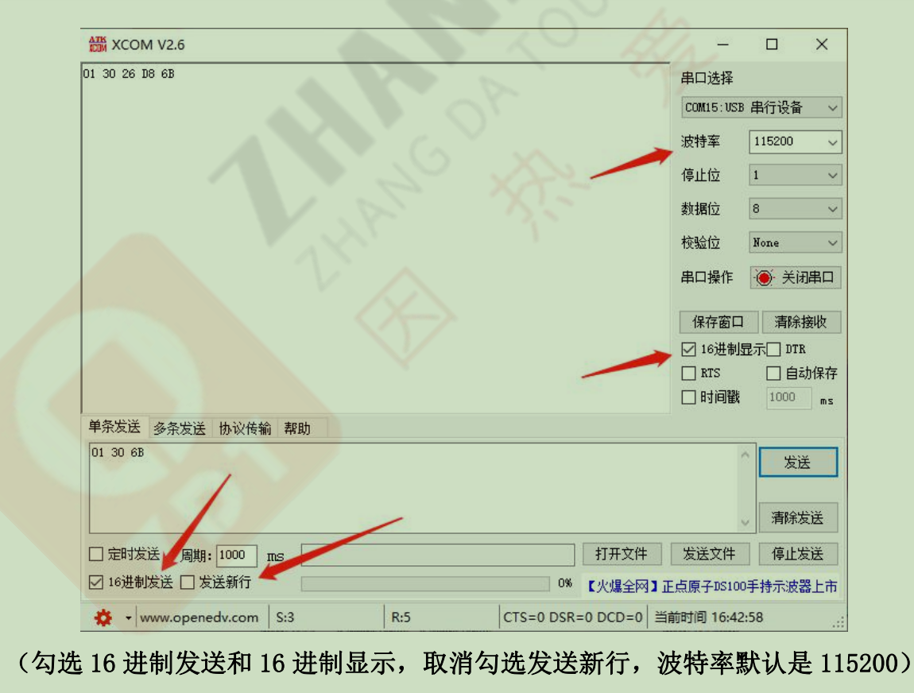

#### can通讯控制说明

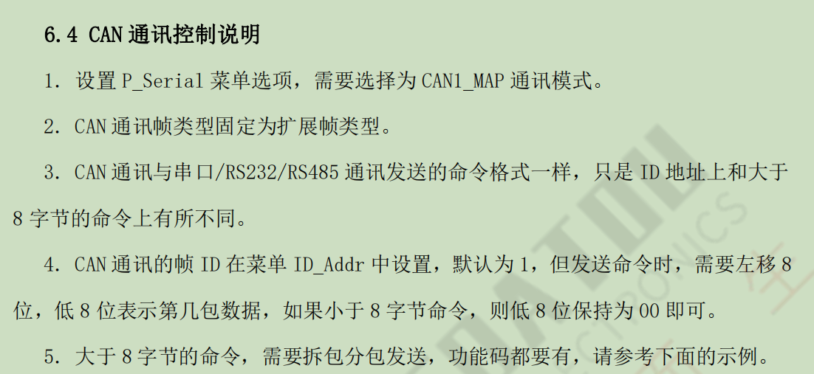

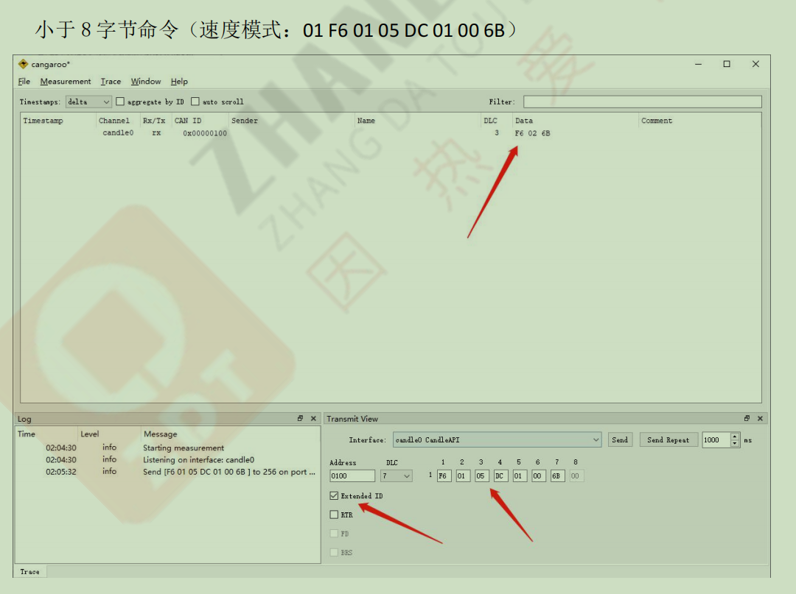

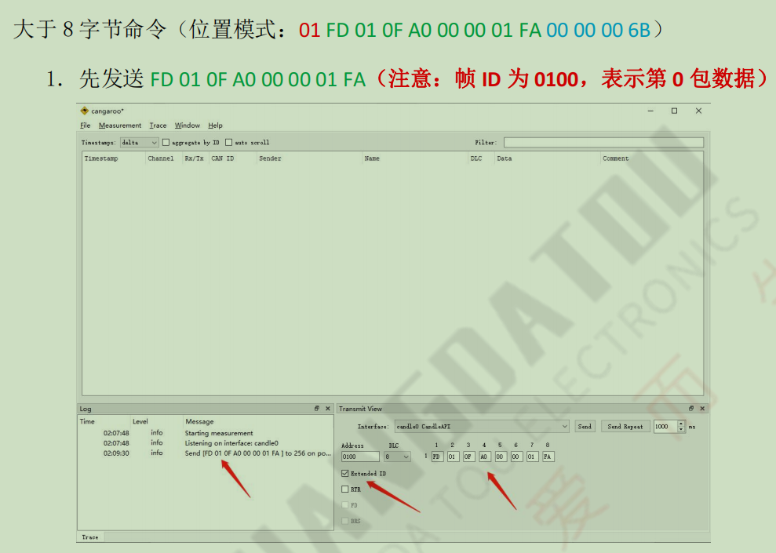

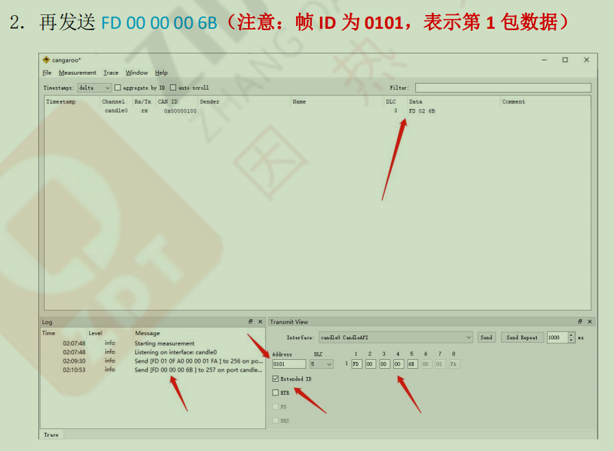