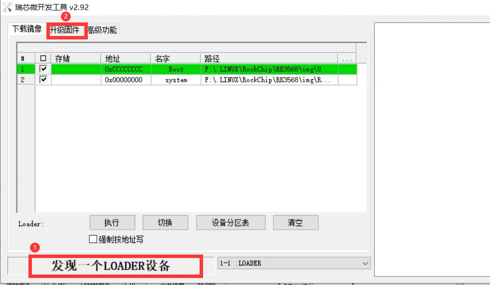
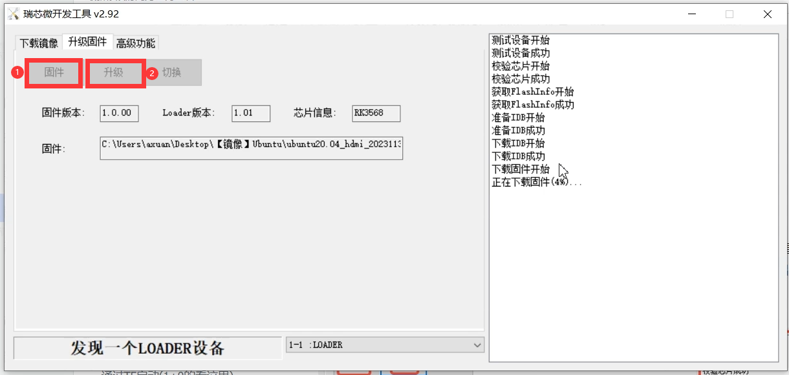

# 立创开发板·泰山派RK3566 教程


## 目录

* 第一章 简介


## 烧录Ubuntu固件

### 准备ubuntu的img镜像文件

（我下载后放在了 [D:\Code_Download\Linux\ubuntu\ubuntu20.04_hdmi_20231130_update.img](D:\Code_Download\Linux\ubuntu)）


### 使用烧录工具（`RKDevTool_Release_v2.92`）进行烧录

#### 首先进入loader模式

* 按住`REC`不放
* 按一下`RST`松开
* 等待固件工具提示搜索到一个loader设备后松开`RES`
* 点击升级固件选项（2）



#### 升级固件

* 点击固件后选择我们的`img`镜像文件
* 再点击升级，等待下载固件成功即可




## 串口通信

使用usb转串口的工具通信即可，串口软件我使用的`mobaxterm`，这里注意波特率选择`150000`，不是`115000`。

### 安装`SSH`

#### 连接wifi

```bash
# 查看附近的WiFi信息
nmcli device wifi list

# 链接wifi (密码我隐藏了)
nmcli device wifi connect DongJiu password tzf187********

# 测试网络是否连接成功
ping www.baidu.com
```

#### 更新源（清华源）

用了一个脚本工具自动更新 https://tuna.moe/oh-my-tuna/

```bash
wget https://tuna.moe/oh-my-tuna/oh-my-tuna.py
# 注意这里是python3而不是python
python3 oh-my-tuna.py
sudo python3 oh-my-tuna.py --global
python3 oh-my-tuna.py -h
```

#### 新建用户

```bash
# 新建用户
adduser txhey
# 给sudo权限
usermod -aG sudo txhey
```

#### 安装ssh

```
apt-get install openssh-client
apt-get install openssh-server
```

#### 使用ssh连接

```bash
# 获取IP地址
ifconfig
```

我这里使用的是`mobaxterm`,输入IP地址后输入用户名密码就行了。