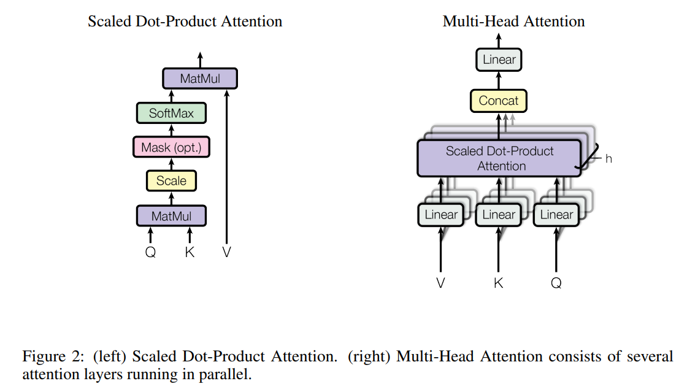

# Attention is All You Need

## Author

几乎都是google公司的人

> 作者名字后面的符号意义：
>
> * `†`和`‡`: 这两位不是google的，是在google实习期间完成的工作
> * `*`: 代表共同贡献

第一页末尾描述了对于该论文的贡献有介绍：（每个作者做了什么内容）

## Abstract

**原文**

The dominant sequence transduction models are based on complex recurrent or convolutional neural networks that include an encoder and a decoder. 

The best performing models also connect the encoder and decoder through an attention mechanism. 

We propose a new simple network architecture, the Transformer, based solely on attention mechanisms, dispensing with recurrence and convolutions entirely. 

Experiments on two machine translation tasks show these models to be superior in quality while being more parallelizable and requiring significantly less time to train. 

Our model achieves 28.4 [BLEU](# BLEU) on the [WMT 2014](# WMT) Englishto-German translation task, improving over the existing best results, including ensembles, by over 2 BLEU. 

On the WMT 2014 English-to-French translation task, our model establishes a new single-model state-of-the-art BLEU score of 41.8 after training for 3.5 days on eight GPUs, a small fraction of the training costs of the best models from the literature. 

We show that the Transformer generalizes well to other tasks by applying it successfully to English constituency parsing both with large and limited training data.

**翻译**

主要的序列转换模型基于复杂的循环或者卷积神经网络，包括encoder-decoder。

表现最好的模型还通过attention机制将encoder和decoder连接起来。

我们提出了一个全新的简单的网络架构：Transformer，仅仅依赖于attention机制，没有用循环和卷积。

我们用了两个机器翻译任务，显示这个模型质量特别好，更好的并行性并且只需要更少的时间来训练。

在2014年的[WMT](# WMT)的英语-德语的翻译任务上，我们的模型达到了28.4的[BLEU](# BLEU)分数，比现在最好的结果（包括集成模型）提升了超过2个BLEU分数。

在2014年的WMT的英语-法语的翻译任务中，我们的模型在8块GPU训练了3.5天后，建立了新的单模型最高BLEU分数为41.8，这比文献中最佳模型的训练成本低很多。

我们通过在大型且有限的训练数据上成功将Transformer应用于英语依存解析，发现Transformer能够很好地泛化到别的任务上。

**总结**

我们提出了一个新的网络架构：Transformer，表现非常牛。而且除了机器翻译领域，在其他类型地任务上也能有很好的效果。

## 1 Introduction

**原文**

Recurrent neural networks, long short-term memory and gated recurrent neural networks in particular, have been firmly established as state of the art approaches in sequence modeling and transduction problems such as language modeling and machine translation. Numerous efforts have since continued to push the boundaries of recurrent language models and encoder-decoder architectures.

Recurrent models typically factor computation along the symbol positions of the input and output sequences. Aligning the positions to steps in computation time, they generate a sequence of hidden states *ht*, as a function of the previous hidden state *ht−1* and the input for position *t*. This inherently sequential nature precludes parallelization within training examples, which becomes critical at longersequence lengths, as memory constraints limit batching across examples. Recent work has achieved significant improvements in computational efficiency through factorization tricks and conditional computation, while also improving model performance in case of the latter. The fundamental constraint of sequential computation, however, remains.

Attention mechanisms have become an integral part of compelling sequence modeling and transduction models in various tasks, allowing modeling of dependencies without regard to their distance in the input or output sequences. In all but a few cases, however, such attention mechanisms are used in conjunction with a recurrent network.

In this work we propose the Transformer, a model architecture eschewing recurrence and instead relying entirely on an attention mechanism to draw global dependencies between input and output. The Transformer allows for significantly more parallelization and can reach a new state of the art in translation quality after being trained for as little as twelve hours on eight P100 GPUs.

**翻译**

特别是RNN，LSTM和GRU已经牢固确立为序列建模和转换问题（比如语言建模和机器翻译）的最新方法。所以人们一直努力扩展循环语言模型和encoder-decoder的边界。

循环模型通常会沿着输入和输出序列的符号位置将计算分解为部分。将位置与计算时间中的步骤对齐，通过上一个隐藏状态*ht-1*和位置输入*t*的函数生成一个隐藏状态*ht*。这种内在的顺序性质排除了在训练示例中的并行性，这在越来越长的序列长度看来变得至关重要，因为内存限制限制了跨示例批处理。最近的工作通过分解技巧和条件计算在计算效率方面取得了显著的改进，同时也在后者的情况下提高了模型性能。然而，序列计算的基本约束依旧存在。

注意力机制已成为各种任务中引人注目的序列建模和转换模型不可或缺的一部分，允许在输入或输出序列中不受距离影响的依赖建模。然而，除了少数情况，注意力机制通常与循环神经网络一起使用。

在这篇论文中，我们提出了Transformer模型架构，它摒弃了循环，而完全依赖于注意力机制来获取输入和输出之间的全局依赖关系。Transformer模型允许显著地提高并行性，并且经过仅十二小时的训练在八个P100 GPU上达到了翻译质量的新的最佳状态。

**总结**

之前常用的序列模型比如：RNN、LSTM、GRU，必须通过上一层的隐藏状态*ht-1*才能得到当前的隐藏状态*ht*，导致了这些模型的并行性非常差，这在当前序列长度越来越长的情况下，性能将会被限制。而且因为历史信息是一步一步往后传的，那么很早的一些信息到后面可能就会消失了，如果使用非常大的ht来解决这个问题，会导致内存开销很大。

注意力机制之前通常与RNN一起使用，在这片论文中，我们提出了Transformer模型架构，摒弃了循环，完全依赖attention机制来获取输入和输出之间的全局依赖关系。Transformer相较于基于attention机制的RNN，拥有更高的并行性。

## 2 Background

**原文**

The goal of reducing sequential computation also forms the foundation of the Extended Neural GPU, ByteNet and ConvS2S, all of which use convolutional neural networks as basic building block, computing hidden representations in parallel for all input and output positions. In these models, the number of operations required to relate signals from two arbitrary input or output positions grows in the distance between positions, linearly for ConvS2S and logarithmically for ByteNet. This makes it more difficult to learn dependencies between distant positions. In the Transformer this is reduced to a constant number of operations, albeit at the cost of reduced effective resolution due to averaging attention-weighted positions, an effect we counteract with Multi-Head Attention as described in section 3.2.

Self-attention, sometimes called intra-attention is an attention mechanism relating different positions of a single sequence in order to compute a representation of the sequence. Self-attention has been used successfully in a variety of tasks including reading comprehension, abstractive summarization, textual entailment and learning task-independent sentence representations.

End-to-end memory networks are based on a recurrent attention mechanism instead of sequence aligned recurrence and have been shown to perform well on simple-language question answering and language modeling tasks.

To the best of our knowledge, however, the Transformer is the first transduction model relying entirely on self-attention to compute representations of its input and output without using sequencealigned RNNs or convolution. In the following sections, we will describe the Transformer, motivate self-attention and discuss its advantages over models such as [17, 18] and [9].

**翻译**

减少顺序计算的目标也构成了Extended Neural GPU、ByteNet和ConvS2S的基础，所有这些都使用卷积神经网络作为基本构建块，并行计算所有输入和输出位置的隐藏表示。在这些模型中，关联来自两个任意输入或输出位置的信号所需的操作数量随着位置之间的距离而增加，对于ConvS2S是线性的，对于ByteNet是对数的。这使得学习远距离位置之间的依赖关系变得更加困难。在Transformer中，这被减少到恒定数量的操作，尽管代价是由于平均注意力加权位置而降低了有效分辨率，如第3.2节所述，我们用Multi-Head Attention来抵消这种影响。

Self-attention，有时称为intra-attention，是一种将单个序列的不同位置联系起来以计算序列的表示的注意机制。自注意已经成功地应用于各种任务中，包括阅读理解、抽象概括、语篇隐含和学习任务无关的句子表征。

End-to-end memory networks基于循环注意力机制，而不是序列对齐的循环机制，并且已被证明在简单的语言问答和语言建模任务中表现良好。

然而，据我们所知，Transformer是第一个完全依靠self-attention来计算其输入和输出表示的转换模型，而不使用序列符号RNN或卷积。在接下来的部分中，我们将描述Transformer，激发self-attention，并讨论其相对于[17，18]和[9]等模型的优势。

**总结**

Extended Neural GPU、ByteNet和ConvS2S这些工作使用CNN替换RNN,但问题在于CNN对于比较长的序列难以建模（卷积操作的窗口比较小，如果两个像素块相隔比较远，就需要很多层卷积才能将两个像素融合起来），但在Transformer中，一次可以看到所有的像素，一层就能看完所有序列。但卷积的优点在于一次可以输出多个通道（卷积核），为了也有这种特点，所以提出了Multi-Head Attention机制。

第二段简单介绍了下self-attention(之前有人提出过)

Transformer是一个完全依赖self-attention来做encode-decode的架构的模型

## 3 Model Architecture

**原文**

Most competitive neural sequence transduction models have an encoder-decoder structure. Here, the encoder maps an input sequence of symbol representations (*x1*, ..., *xn*) to a sequence of continuous representations **z** = (*z1*, ..., *zn*). Given **z**, the decoder then generates an output sequence (*y1*, ..., *ym*) of symbols one element at a time. At each step the model is auto-regressive [10], consuming the previously generated symbols as additional input when generating the next.

The Transformer follows this overall architecture using stacked self-attention and point-wise, fully connected layers for both the encoder and decoder, shown in the left and right halves of Figure 1, respectively.

**翻译**

大多数具有竞争力的神经序列转换模型都具有encoder-decoder结构。encoder将输入符号序列 (*x1*, ..., *xn*) 映射到连续表示序列**z** = (*z1*, ..., *zn*)，解码器根据z生成输出序列 (*y1*, ..., *ym*) ，每次生成一个元素。模型在每个步骤中都是自回归的（前面的输出会成为当前的额外输入）。

Transformer遵循这一总体架构，使用堆叠的self-attention和point-wise、全连接层的编码器和解码器层，分别如图1的左半部分和右半部分所示。

**总结**

解释了以下encoder-decoder的结构：n个输入序列 *x* 通过encoder生成序列 *z* ，decoder通过 *z* 生成输出序列 *y* 。每个步骤都是自回归的。

Transformer就遵循encoder-decoder架构，将self-attention、point-wise、全连接层堆叠在一起。

### 3.1 Encoder and Decoder Stacks

**原文**

**Encoder:**  The encoder is composed of a stack of *N* = 6 identical layers. Each layer has two sub-layers. The first is a multi-head self-attention mechanism, and the second is a simple, position wise fully connected feed-forward network. We employ a residual connection around each of the two sub-layers, followed by layer normalization. That is, the output of each sub-layer is  [LayerNorm](# Batch Norm & Layer Norm)(*x* + Sublayer(*x*)) , where Sublayer(*x*) is the function implemented by the sub-layer itself. To facilitate these residual connections, all sub-layers in the model, as well as the embedding layers, produce outputs of dimension *d*model＝512.

**Decoder:**  The decoder is also composed of a stack of *N* = 6 identical layers. In addition to the two sub-layers in each encoder layer, the decoder inserts a third sub-layer, which performs multi-head attention over the output of the encoder stack. Similar to the encoder, we employ residual connections around each of the sub-layers, followed by layer normalization. We also modify the self-attention sub-layer in the decoder stack to prevent positions from attending to subsequent positions. This masking, combined with fact that the output embeddings are offset by one position, ensures that the predictions for position *i* can depend only on the known outputs at positions less than *i*.

**翻译**

**Encoder:** 编码器由*N*=6个相同层的堆栈组成。每层有两个子层。第一个子层是multi-head self-attention mechanism，第二种是简单的position wise fully connected feed-forward network（就是个MLP）。我们在两个子层的每一个子层周围使用残差连接，然后进行层归一化(layer normalization)。也就是说，每个子层的输出是  [LayerNorm](# Batch Norm & Layer Norm)(*x* + Sublayer(*x*)) ，其中 Sublayer(*x*) 是子层本身实现的函数。为了便于这些残余连接，模型中的所有子层以及嵌入层输出的维度*d*model＝512。

**Decoder:** 解码器也由*N*＝6个相同层的堆栈组成。除了每个编码器层中的两个子层之外，解码器还插入第三个子层，该第三子层对编码器堆栈的输出执行多头关注。与编码器类似，我们在每个子层周围使用残差连接，然后进行层归一化。我们还修改了解码器堆栈中的自注意子层，以防止位置关注后续位置。这种掩蔽，再加上输出嵌入偏移一个位置的事实，确保了对位置*i*的预测只能取决于小于*i*位置的已知输出。

**总结**

如图所示，Transformer架构由encoder和decoder构成

encoder由6个相同层的堆栈组成，每层有两个子层，分别是multi-head self-attention 和 全连接层，两个子层周围使用残差连接，然后进行层归一化（Layer Normalization）。

decoder也是由6个相同层的堆栈组成，每层有3个子层，最底层多了一个masked multi-head self-attention子层，用于防止关注后续的数据，只关注t之前的内容

### 3.2 Attention

**原文**

An attention function can be described as mapping a query and a set of key-value pairs to an output, where the query, keys, values, and output are all vectors. The output is computed as a weighted sum of the values, where the weight assigned to each value is computed by a compatibility function of the query with the corresponding key.

Figure 2: (left) Scaled Dot-Product Attention. (right) Multi-Head Attention consists of several attention layers running in parallel. 

**翻译**

注意力函数可以描述为将查询和一组键值对映射到输出，其中查询、键、值和输出都是向量。输出被计算为值的加权和，其中分配给每个值的权重由查询与相应关键字的兼容性函数计算。

#### 3.2.1 Scaled Dot-Product Attention

#### 3.2.2 Multi-Head Attention

#### 3.2.3 Applications of Attention in our Model

### 3.3 Position-wise Feed-Forward Networks

### 3.4 Embeddings and Softmax

## Conclusion

**原文**

In this work, we presented the Transformer, the first sequence transduction model based entirely on attention, replacing the recurrent layers most commonly used in encoder-decoder architectures with multi-headed self-attention.

For translation tasks, the Transformer can be trained significantly faster than architectures based on recurrent or convolutional layers. On both WMT 2014 English-to-German and WMT 2014 English-to-French translation tasks, we achieve a new state of the art. In the former task our best model outperforms even all previously reported ensembles.

We are excited about the future of attention-based models and plan to apply them to othertasks. We plan to extend the Transformer to problems involving input and output modalities other than text and to investigate local, restricted attention mechanisms to efficiently handle large inputs and outputs such as images, audio and video. Making generation less sequential is another research goals of ours.

The code we used to train and evaluate our models is available at https://github.com/tensorflow/tensor2tensor.

**翻译**

在这篇论文中，我们提出了Transformer，这是首个完全基于attention的序列转换模型，通过multi-headed self-attention机制替代了encoder-decoder架构中最常用的循环层。在翻译任务中，Transformer的训练速度比基于循环或卷积层的架构快很多。在2014年WMT的*英语-德语*和*英语-法语*的翻译任务中，我们达到了新的最佳水平。在前一个任务中，我们最好的模型甚至超过了之前报道过的所有集合的性能。

我们对于基于attention机制的模型的未来感到兴奋，并计划将其应用于其他任务。我们计划将Transformer扩展到除了文本输入输出之外的其他输入输出模式的问题上，并研究局部、受限的attention机制，以有效地处理大型输入输出比如图像、音频和视频。让生成不那么连续化也是另外一个研究方向。

我们用来训练和评估模型的代码放在了： https://github.com/tensorflow/tensor2tensor.

**总结**

这篇论文介绍了一个全新的基于attention机制的序列转换模型：Transformer。使用multi-headed self-attention机制。

这个架构的训练速度、性能都非常好。

Transformer在其他领域也会有更好的效果。

训练和评估代码放在了：https://github.com/tensorflow/tensor2tensor

## 问题总结：

###### Positional Encoding

###### Add & Norm

###### Feed Forward

###### Masked Multi-Head Attention

###### Multi-Head Attention

###### residual connection (残差)

  

###### Batch Norm & Layer Norm

Normalization:
$$
x^`_i = \frac{x_i - \mu}{\sigma}
$$

* Batch Norm: 一批的同一个元素
* Layer Norm: 每个用例的所有元素

为什么Transformer需要Layer Norm：

* 因为翻译任务的序列长度不一样
* 批次规模复杂
  * 例子：现有两个批次，分别是尖子班和较差班，你数学都是90分，normalization将分数标准化到[0,1]（标准正太分布）,这就导致同样的分数在尖子班的归一化分数极低，但在较差班的归一化分数非常高，这其实很不公平，训练效果也不好
* 计算依赖性 ：同一批次的后一个数据必须等前一个数据，全部加载完后才能进行normalization，比layer慢
* 适应性和泛化能力： 同一个数据的不同元素进行norm（也就是layer norm），除了将数据压平，不同元素之间的相关性不变，高的仍然是高的，个性能够保留下来。

###### point-wise

###### BLEU

(Bilingual Evaluation Understudy)

是一种用于评估机器翻译和自然语言生成任务中输出文本质量的评估指标。它通过比较生成的文本与一个或多个参考文本来计算相似度分数。

###### WMT

(Workshop on Machine Translation)

是一个年度研讨会，聚集了来自学术界和工业界的研究人员和从业人员，专注于机器翻译和其他语言技术。

WMT 2014 是其中的一届，举办于2014年。WMT 2014 包含了多种任务和评估活动，以推动机器翻译技术的发展和改进。

[^ asdf]: 
