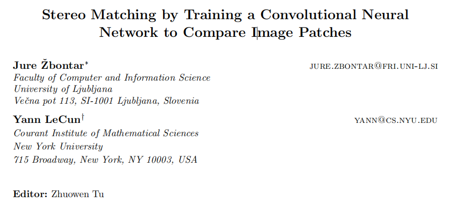

# [论文精读解析]： Stereo Matching by Training a Convolutional Neural Network to Compare Image Patches

通过训练卷积神经网络比较图像块进行立体匹配

* **Authors**: Jure Žbontar, Yann LeCun
* **Publication**: Journal of Machine Learning Research (CCF A)
* **Submitted**: 20 Oct 2015 (`v1`)
* **Last revised**: 18 May 2016 (`v2`)
* **Link**: https://arxiv.org/abs/1510.05970

查看全文翻译内容请点击跳转：[Stereo_Matching_translation.md](./Stereo_Matching_translation.md)

