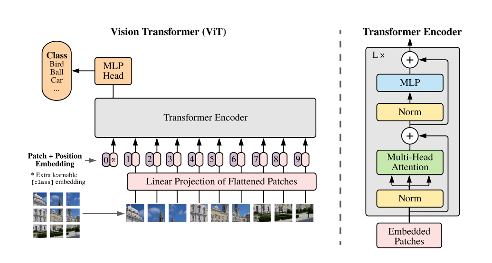
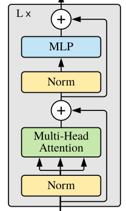

# [论文精读] An Image Is Worth 16×16 Words: Transformers for Image Recognition at Scale

一幅图像价值相当于16x16个单词：规模化的图像识别中的Transformer模型

* **Author**: Alexey Dosovitskiy等
* **Publish**: pubished as a conference paper at ICLR 2021
* **First Submission**: Thu, 22 Oct 2020
* **Last Modify**: Thu, 3 Jun 2021
* **Link**: https://arxiv.org/abs/2010.11929

> 这篇论文又是Google出品

## Abstract

一般Transformer主要用于NLP任务，在CV领域一般结合CNN使用。但是VIT使用纯粹的Transformer应用于图像分类任务中表现非常好，在更少的计算机资源情况下，获得与最先进的CNN网络一样优秀的效果。

## 1 Introduction

基于注意力机制的架构，特别是Transformers，已经成文NLP任务的首选模型，使用pre-train + fine-tune方法。由于Transformers的计算效率和可扩展性，现在已经拥有超过1000亿参数的超大模型，性能仍然没有饱和。

在CV领域，卷积架构仍然是主流。随着NLP的成功启发，许多研究尝试将CNN与self-attention相结合，一些研究甚至完全替代了卷积。但尽管这些模型在理论上是高效的，但由于使用了专门的注意力模式，尚未能在现代硬件加速器上有效扩展。因此，在大规模图像识别中，经典的类似ResNet的架构仍然是最先进的。

受Transformer在NLP中的扩展成功的启发，我们尝试将标准的Transformer应用于图像，进行尽量少的修改。为此，我们将图像分割成多个块，并将这些图像块的线性嵌入序列作为输入提供给Transformer。图像块被视为与NLP处理应用中的tokens相同的方式处理。我们以有监督方式对图像分类任务进行模型训练。

在mid-sized的数据集（ImageNet）上进行训练且没有强正则化时，准确率比ResNet低了几个百分点。这种看似令人沮丧的结果可能是可以预料的：Transformer缺乏一些CNN固有的归纳偏差，例如平移等变性和局部性，因此在训练数据量不足的情况下无法很好地泛化。

然而，如果在更大的数据集（1400万至3亿图像）上进行训练，情况就会改变。我们发现，大规模训练胜过归纳偏差。我们的Vision Transformer (ViT) 在进行足够规模的预训练并转移到数据量较少的任务时，取得了优秀的结果。当在公开的ImageNet-21k数据集或内部的JFT-300M数据集上进行预训练时，ViT在多个图像识别基准测试中接近或超过了最先进的技术。具体而言，最佳模型在ImageNet上的准确率达到了88.55%，在ImageNet-ReaL上的准确率为90.72%，在CIFAR-100上的准确率为94.55%，在VTAB的19个任务套件上达到了77.63%的准确率。

## 2 Related Work

Transformers由Vaswani等人（2017年）提出，用于机器翻译，自此在许多自然语言处理（NLP）任务中成为了最先进的方法。大型基于Transformer的模型通常在大型语料库上进行预训练，然后针对具体任务进行微调：BERT（Devlin等，2019年）使用去噪自监督预训练任务，而GPT系列工作使用语言建模作为预训练任务（Radford等，2018；2019；Brown等，2020）。

对图像直接应用自注意力机制需要每个像素都关注到其他每个像素，像素数量的平方成本使其无法扩展到现实的输入规模。因此，为了在图像处理中应用Transformers，以前尝试了几种近似方法。Parmar等人（2018年）仅在每个查询像素的局部邻域中应用自注意力，而不是全局应用。这样的局部多头点积自注意力块可以完全替代卷积（Hu等，2019；Ramachandran等，2019；Zhao等，2020）。在另一项工作中，Sparse Transformers（Child等，2019年）采用可扩展的全局自注意力近似，以适用于图像。另一种扩展注意力的方法是按不同大小的块应用它（Weissenborn等，2019年），在极端情况下仅沿单个轴应用（Ho等，2019年；Wang等，2020年a）。许多这种特殊的注意力架构在计算机视觉任务中展示了有希望的结果，但需要复杂的工程才能在硬件加速器上高效实施。

与我们的工作最相关的是Cordonnier等人（2020年）的模型，该模型从输入图像中提取2 × 2大小的块并在其上应用全自注意力。这个模型与ViT非常相似，但我们的工作进一步证明了大规模预训练使得原始Transformers可以与（甚至优于）最先进的CNN竞争。此外，Cordonnier等人（2020年）使用2 × 2像素的小块，这使得模型仅适用于小分辨率图像，而我们则处理中等分辨率的图像。

结合卷积神经网络（CNN）和自注意力形式的兴趣也很大，例如通过增强图像分类的特征图（Bello等，2019年）或通过使用自注意力进一步处理CNN的输出，例如用于目标检测（Hu等，2018年；Carion等，2020年）、视频处理（Wang等，2018年；Sun等，2019年）、图像分类（Wu等，2020年）、无监督对象发现（Locatello等，2020年），或统一的文本-视觉任务（Chen等，2020c；Lu等，2019年；Li等，2019年）。

另一个最近相关的模型是图像GPT（iGPT）（Chen等，2020年a），它在降低图像分辨率和色彩空间后将Transformers应用于图像像素。该模型以无监督的方式作为生成模型进行训练，所得到的表示可以进行微调或线性探测以进行分类性能，最大在ImageNet上达到72%的准确率。

我们的工作增加了探索比标准ImageNet数据集更大规模图像识别的论文集合。使用额外的数据源可以在标准基准上实现最先进的结果（Mahajan等，2018年；Touvron等，2019年；Xie等，2020年）。此外，Sun等（2017年）研究了CNN性能如何随数据集规模扩展，而Kolesnikov等（2020年）；Djolonga等（2020年）进行了从大型数据集（如ImageNet-21k和JFT-300M）进行CNN迁移学习的经验探索。我们也关注这两个数据集，但训练Transformers而不是以前工作中使用的基于ResNet的模型。

图 1：模型概述。我们将图像分割成固定大小的块，对每个块进行线性嵌入，添加位置嵌入，并将得到的向量序列输入到标准的Transformer编码器中。为了进行分类，我们使用了在序列中添加一个额外可学习的“分类标记”的标准方法。Transformer编码器的插图受Vaswani等人（2017年）的启发。

## 3 Method

在模型设计中，我们尽可能地遵循原始的Transformer（Vaswani等，2017）。这种有意简化的设置的一个优势是，可扩展的NLP Transformer架构及其高效实现几乎可以直接使用。

### 3.1 Vision Transformer（VIT）

如图一所示，其实VIT整体结构就是Transformer的Encoder部分，只是入参从词向量（`word embedding`）变成了`patch embedding`
$$
\begin{align*}
& z_0 = [x_{class}; x^1_pE; x^2_pE; ...; x^N_pE] + E_{pos} \tag{1} \\
& z^`_l = MSA(LN(z_{l-1})) + z_{l-1} \qquad l:1...L \tag{2} \\
& z_l = MLP(LN(z^`_{l})) + z^`_{l} \qquad l:1...L \tag{3} \\
& y = LN(z^0_L) \tag{4} \\
\end{align*}
$$

#### 输入处理

见**公式（1）**

Transformer的输入是一维的（token），所以将图片划分为多个小patch，再展成一维。
$$
(H,W,C) => (N, P^2, C)
$$

* `H,W`：图片的宽高分辨率
* `C`: 通道数
* `P`: 一个Patch的宽高（base模型为16）
* `N`: patch个数，计算方式：$$ N = \frac{H*W}{P^2} $$

Transformer中的输入叫`Word Embedding`，这篇论文中输入叫`patch Embedding`。给patch的开头添加一个可学习的class token。给patch添加位置信息 pos（这里使用1D的位置信息，实验表明使用2D位置信息性能并没有明显提升）

#### Transformer

见**公式2，3，4**

模型主体部分和Transformer一模一样，每个块都是

`LayerNorm` + `Multi-Head Attention` + `residual` + `MLP`

#### Inductive bias

VIT的图片特别的归纳偏差比CNNs少了很多，在CNNs中，局部性、二维邻域结构和平移等变形被整个模型的每一层所固化。（因为CNN是对二维数据进行处理，所以图片中每个像素点之间的二维位置、局部性等都是固定的）。但在VIT中，因为二维数据变成了一维数据，局部和平移只有在MLP层中，自注意力层是全局的。而且初始时的位置嵌入不包含patches的二维信息，所有的patch之间的空间关系都要从头学习。

#### Hybrid Architecture

混合架构。使用RNN对图像进行处理

## 其他总结

### 归纳偏差（Inductive bias）

是指在机器学习中，模型在学习过程中对某些假设或者预测更有倾向性的一种偏好或偏向。

#### 图像特定的归纳偏差（image-specific inductive bias）

由于图像数据的特殊性质，比如像素之间的空间相关性、局部和全局特征的存在等，导致了在处理图像时，模型可能会有一些固有的偏好。例：

* **局部性和空间相关性**：图像中相邻像素之间往往存在相关性，即空间位置靠近的像素通常具有相似的特征。因此，很多图像处理任务中的模型，如卷积神经网络（CNN），会利用局部滤波器和池化操作来捕捉这种局部特征。
* **平移不变性**：大多数图像识别任务中，我们关心对象是否出现在图像中，而不关心其出现的具体位置。为了实现平移不变性，CNN等模型会使用共享的权重和池化操作，从而使模型对于对象的位置变化具有一定的鲁棒性。
* **尺度不变性**：物体在图像中的尺度可能会有所不同，但其关键特征通常是相对稳定的。模型可能会在设计中考虑到尺度变化带来的影响，比如使用多尺度特征提取或者数据增强技术。
* **组合特征**：图像中的对象通常由多种局部特征组合而成，例如边缘、颜色和纹理等。模型可能会倾向于使用多层次的特征提取和组合方式，以更好地表示和理解图像中复杂的结构。
* **空间变换不变性**：图像中的对象可能以不同的方式旋转、缩放或变形，但它们的本质特征通常不会因此而改变。某些模型可能会通过数据增强或者特定的网络结构设计来增强对这些变换的鲁棒性。